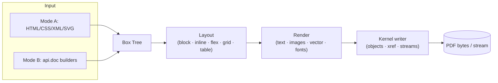
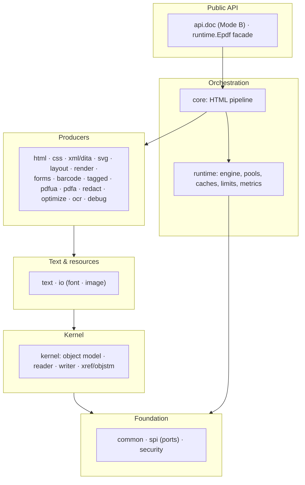
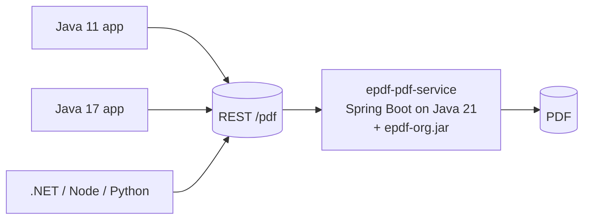

<div align="center">

# ePDF Engine — `epdf-org`

**A single‑JAR, zero‑dependency, license‑clean PDF engine for the JVM.**
Turn **HTML / CSS / XML / SVG** — or a **programmatic Java model** — into PDF, and
read / merge / optimize / redact / tag existing PDFs. All original clean‑room code.


</div>

> **One import. One jar. One engine.** Package root `com.epdfengine.rb.org`.
> Built on Java 21; consumable from any language/runtime via a thin REST service.

---

## Contents

- [Why epdf‑org](#why-epdf-org)
- [How it compares (iText · PDFBox · headless Chromium)](#how-it-compares)
- [Quick start](#quick-start)
- [The two modes (A & B)](#the-two-modes)
- [How it works](#how-it-works)
- [Architecture for organizations](#architecture-for-organizations)
- [Use it from Java 11 / 17 / any language](#use-it-from-java-11--17--any-language)
- [Why Java 21](#why-java-21)
- [Scalability & concurrency](#scalability--concurrency)
- [Benchmark](#benchmark)
- [Deploy on Azure / AWS / AEM](#deploy-on-azure--aws--aem)
- [Security](#security)
- [Feature matrix](#feature-matrix)
- [Limitations (honest)](#Limitations)
- [Get the jar](#get-the-jar)
- [Open source — fork & modify](#open-source--fork--modify)
- [Contributing](#contributing)
- [Documentation](#documentation)

---

## Why epdf‑org

| | |
|---|---|
| 🧩 **Zero third‑party dependencies** | Pure JDK. No transitive CVEs, no supply‑chain risk, no license entanglement. |
| ⚖️ **Permissive open source** | Use in **commercial / closed‑source** products, **fork and modify** freely — just keep the notice. Not AGPL. |
| 🪶 **Lightweight** | One ~560 KB jar that runs **inside your JVM** — no browser farm, no native processes. |
| 🎨 **Two ways to author** | **Mode A:** HTML/CSS/XML/SVG. **Mode B:** fluent Java builders. Both converge on one box tree. |
| 🚀 **Scales by design** | Bounded worker pool + backpressure + virtual‑thread I/O + streaming writer are **built in** — you don't write a render queue. |
| 🔒 **Secure by construction** | SSRF/XXE/decompression‑bomb guards, resource limits, crypto‑free boundary, host‑only debug. |
| ♿ **Compliant output** | PDF/A‑2b, PDF/UA‑1 tagging, embedded/subset fonts, barcodes, forms, optimize & linearize (fast web view). |

**For a small business:** no licensing fees, no AGPL obligations, no heavyweight
browser to host — it runs in the container you already have, and you can adapt the
source to your needs.

---

## How it compares

ePDF is positioned differently from low-level PDF libraries and browser-based
HTML-to-PDF solutions. The comparison below focuses on architectural trade-offs,
not on declaring one solution universally better than another.

| Capability | **ePDF** | **iText / similar PDF libraries** | **Apache PDFBox** | **Headless Chromium** |
|---|---|---|---|---|
| Primary approach | Document rendering engine | PDF/document library | Low-level PDF library | Browser rendering |
| Runs inside the JVM | ✅ | ✅ | ✅ | ❌ separate browser process |
| Zero third-party runtime dependencies | ✅ | ❌ | ❌ | ❌ |
| Programmatic document API | ✅ | ✅ | ⚠️ lower-level | ❌ browser-oriented |
| HTML/CSS document authoring | ✅ | Product/module dependent | ❌ not native HTML layout | ✅ |
| XML / DITA publishing workflow | ✅ | Custom implementation / product dependent | Custom implementation | Custom preprocessing |
| CSS-driven layout | ✅ supported subset | Product/module dependent | ❌ | ✅ highest browser compatibility |
| Flex / grid / document layouts | ✅ | Product dependent | Manual implementation | ✅ browser implementation |
| Structured PDF generation | ✅ | ✅ | ✅ | Via browser print pipeline |
| Built-in document processing pipeline | ✅ | Varies by product/modules | Mostly application-built | Browser-managed |
| Built-in concurrency / backpressure model | ✅ | Application responsibility | Application responsibility | Browser-pool orchestration |
| PDF manipulation toolkit | Merge, optimize, linearize, visual redact, forms | Broad | Broad | Limited / external tooling |
| Runtime model | Single JVM library | JVM library | JVM library | Browser + automation/runtime |
| Operational footprint | Small in-process deployment | JVM dependency stack | JVM dependency stack | Full browser runtime |
| CSS fidelity | Document-oriented subset | Product dependent | n/a | Highest |
| Cryptography | ❌ intentionally outside core | Product dependent | Product dependent | Not a core browser-PDF feature |

### The trade-off

**Choose ePDF when** you want an in-JVM, zero-dependency document engine with
structured HTML/CSS/XML/DITA workflows, programmatic Java authoring, built-in
layout and rendering, and an internal model for concurrent document generation.

**Choose a browser renderer when** exact browser CSS/HTML behavior is more
important than runtime footprint and operating a browser process is acceptable.

**Choose a low-level PDF library when** your application needs direct control
over PDF objects or requires features outside ePDF's document-rendering scope.

**Choose based on your workload.** ePDF does not try to be a complete web browser
or a replacement for every mature PDF toolkit; its goal is to provide a compact,
structured, extensible PDF engine with modern document-layout capabilities.

---

## Quick start

```xml
<dependency>
  <groupId>io.github.rbgroup-org</groupId>
  <artifactId>epdf-org</artifactId>
  <version>0.1.0-rb</version>
</dependency>
```

```java
import com.epdfengine.rb.org.runtime.Epdf;
import com.epdfengine.rb.org.runtime.RenderRequest;
import com.epdfengine.rb.org.api.doc.*;

try (Epdf engine = Epdf.create()) {                       // shared, thread-safe, reusable

    // Mode A — layout defined in HTML/CSS
    byte[] a = engine.render(RenderRequest.of("""
        <style>@page { size:A4; margin:40pt } h1{color:#0f172a}</style>
        <h1>Invoice #42</h1><p>Thank you for your business.</p>
        """).build()).bytes();

    // Mode B — layout defined in Java
    Document doc = Document.of(PageSpec.A4).margins(40)
        .add(Paragraph.heading(1, "Invoice #42"))
        .add(Table.columns("50%","25%","25%")
                 .header("Item","Qty","Amount")
                 .row("Widget","2","$9.99"))
        .add(Barcode.qr("https://example.org/inv/42").width(72));
    byte[] b = engine.render(RenderRequest.of(doc).build()).bytes();
}
```

Manipulate existing PDFs (static toolkit):

```java
byte[] merged  = PdfMerger.merge(a, b);
byte[] compact = PdfOptimizer.optimize(pdf);      // object/xref streams + dedup
byte[] fastWeb = Linearizer.linearize(pdf);       // fast web view
byte[] filled  = FormFiller.fill(pdf, Map.of("name","Ada"));
```

---

## Authoring modes

ePDF provides two ways to create the same internal document model:

- **Mode A — Markup:** HTML/CSS, XML/DITA and SVG-based document authoring.
- **Mode B — Java API:** fluent programmatic document construction.

Both modes use the same rendering engine and converge on the same internal
layout and box model.

Use the mode that best fits your application:

- Choose **Mode A** for template-driven, markup-based and structured publishing workflows.
- Choose **Mode B** for code-driven document generation and programmatic control.

For the complete syntax, supported elements, attributes, CSS capabilities,
XML/DITA support and examples, see:

**[Mode A & Mode B Syntax Guide](docs/15-mode-a-and-mode-b-syntax.md)**
---

## How it works



Each render is one job on a bounded worker pool, with its own context, limits and
optional trace — no shared mutable state between jobs.

---

## Architecture for organizations

Strictly layered, **dependencies point downward only**, and **nothing third‑party**
is pulled in — an architect can vouch for the whole supply chain.



Anything the engine must **not** do itself is a **port** (`spi`): `CryptoProvider`
(default *none* — the build is provably crypto‑free), `FontProvider`,
`ImageDecoderProvider`, `TelemetrySink`. Deep dive: **[docs/01](docs/01-architecture.md)**.

---

## Use it from Java 11 / 17 / any language

The engine needs **Java 21 to run**, but your callers don't. Wrap it in a thin REST
service (a small Spring Boot app that depends on this jar, runs its own JDK 21) and
call it over HTTP from **any** runtime — a legacy Java 11/17 app, .NET, Node, Python.



Because scalability lives **inside** the engine (bounded pool, backpressure,
streaming), the service stays thin — you don't re‑implement a render queue in every
app that needs a PDF.

**Adobe AEM:** AEM commonly runs on **Java 11/17**, so this Java‑21 jar can't load
directly as an OSGi bundle there — call the **microservice over HTTP** from a Sling
servlet/service (this also keeps PDF CPU off the AEM JVM). If your AEM JVM is Java 21,
you can bundle it in‑process. See **[docs/17](docs/17-deployment-and-scaling.md)**.

---

## Why Java 21

Java 21 is the current **LTS** (supported for years), and the engine uses its
modern features deliberately:

- **Virtual threads** — millions of cheap threads for blocking I/O (remote
  font/image fetches) without pinning OS threads → high I/O concurrency per instance.
- **Records & sealed types** — a compact, immutable, exhaustively‑matched PDF object
  and box model → less code, fewer bugs.
- **Pattern‑matching `switch`** — clean, safe handling of the sealed hierarchies.
- **Generational ZGC** — sub‑millisecond GC pauses under high allocation → stable
  tail latency at scale.

**Trade‑off:** the engine requires a JDK 21 runtime. Teams on Java 11/17 adopt it as
the **REST microservice** above — a one‑time integration, zero code churn afterward.

---

## Scalability & concurrency

Built for high volume with **stable memory** — you get it for free:

- **Bounded CPU pool ≈ cores** for the CPU‑bound layout/render (never oversubscribes).
- **Virtual‑thread I/O pool** for blocking resource fetches (prefetch many assets at once).
- **Backpressure** — a full queue raises `BackpressureException` (shed load cleanly)
  instead of unbounded queuing / OOM. Tune with `EngineConfig.withCpuThreads/withQueueCapacity`.
- **Per‑job deadlines & cancellation** — a runaway document is cancelled, its state freed.
- **Streaming writer** — emits to your `OutputStream`; peak heap ≈ page working set, not whole document.
- **Byte‑bounded LRU caches** (fonts/images by content hash) + **pooled Deflater**; **no static mutable state**.
- **Observability** — `engine.stats()`, `engine.metrics()`, `engine.runtimeStats().heapUsedRatio()`.

> You don't need to engineer scalability into your application code — it's in the
> engine. If you *want* finer control (thread counts, queue depth, caches, limits),
> `EngineConfig` exposes it. Details: **[docs/07](docs/07-scalability-runtime.md)**.

---

## Benchmark

Warm 8‑core box, JDK 21, **5,000 timed renders** of a ~1‑page invoice (25‑row styled
table, Mode A HTML/CSS), engine sized `threads = cores`:

| Metric | Value |
|---|---|
| **Throughput** | **~520 PDFs/sec** (~1.9 M/hour on one 8‑core box) |
| **Per‑document** | **~15 ms** service time |
| Completed / failed / rejected | 5,000 / 0 / 0 |

CPU‑bound and ~linear: more cores or more replicas scale it up; heavier documents
(multi‑page, images) scale it down. Representative microbenchmark, **not a certified
SLA** — measure with your own templates. Reproduce: `proto/test/pdfa-verify/GenBench.java`.

---

## Deploy on Azure / AWS / AEM

Run it **embedded** (your app is already on Java 21) or as a **thin PDF microservice**
(a small Spring Boot app on its own JDK 21 that any Java 11/17/.NET/Node/Python caller
hits over HTTP). Because the engine carries in‑process scalability, your wrapper is
~30 lines — a shared engine bean, `429` + `Retry‑After` on `BackpressureException`,
a streaming endpoint, and health probes — and the **platform adds replicas via CPU
autoscaling**:

- **Azure:** Container Apps (KEDA, scale‑to‑zero) or AKS + HPA.
- **AWS:** ECS on Fargate (Service Auto Scaling) or EKS + HPA; Lambda only for low/spiky volume.
- **AEM:** call the microservice over HTTP (AEM is usually Java 11/17).

Right‑size for CPU (whole vCPUs per pod, engine threads = vCPUs, autoscale ~70% CPU).
Instances are **stateless and share nothing**, so scaling out is linear. Full guide,
checklist and code: **[docs/17 — Deployment, Scaling & Integration](docs/17-deployment-and-scaling.md)**.

---

## Security

Security is a **design property**, not an add‑on:

- **Zero dependencies → no transitive CVE surface** to monitor.
- **SSRF‑safe** resource loading: host allowlist, resolved‑IP pinning, no blind
  redirects, blocked private/link‑local/metadata ranges.
- **XXE‑proof** XML/HTML: no external entities/DTDs; entity‑expansion & nesting caps.
- **Decompression‑bomb guards** on every filter; image pixel/dimension caps; bounded xref recovery.
- **Resource limits** (`ResourceLimits`): max input bytes, pages, nodes, wall‑clock.
- **Crypto‑free boundary** — no cryptographic code in the build (SPI hook only).
- **Debug is host‑only** — a document (CSS/HTML/XML) has **no** way to enable tracing
  or write files. Details: **[docs/08](docs/08-security.md)** · **[docs/16](docs/16-debugging.md)**.

> Note: `Redactor` performs **visual** redaction (opaque bars); it does not remove
> underlying text/images — do not rely on it to strip extractable data.

---
## Feature matrix

| Capability | Support |
|---|---|
| HTML document authoring | ✅ |
| CSS styling | ✅ supported subset |
| XML document processing | ✅ |
| DITA topics | ✅ |
| DITA maps | ✅ |
| Topic linearization | ✅ |
| SVG | ✅ |
| Page size and margins | ✅ |
| Block / inline layout | ✅ |
| Flex layouts | ✅ |
| Grid layouts | ✅ |
| Multi-column layouts | ✅ |
| Tables | ✅ |
| Lists | ✅ |
| Images | ✅ |
| Gradients | ✅ |
| Shadows | ✅ |
| Blur / modern visual effects | ✅ supported rendering features |
| Keyframe / animation processing | See syntax documentation |
| Embedded fonts | ✅ |
| Font subsetting | ✅ |
| Font fallback | ✅ |
| Barcodes | QR, Code128, Code39, EAN-13, DataMatrix |
| PDF forms / AcroForm | ✅ |
| Form filling / flattening | ✅ |
| PDF/A-2b | ✅ |
| PDF/UA-1 tagging | ✅, capability varies by document/mode |
| Merge / split | ✅ |
| Optimization | ✅ |
| Linearization / fast web view | ✅ |
| Redaction | ⚠️ visual redaction |
| Concurrent rendering | ✅ |
| Bounded worker execution | ✅ |
| Backpressure | ✅ |
| Streaming output | ✅ |
| Metrics / runtime statistics | ✅ |
| Built-in encryption | ❌ |
| Built-in digital signatures | ❌ |

> For exact syntax and implementation details, including supported HTML elements,
> XML/DITA structures, CSS properties, layout rules, keyframes and Mode A/Mode B
> APIs, see the [complete syntax documentation](docs/15-mode-a-and-mode-b-syntax.md).

---

## Limitations

ePDF is a document-rendering engine and intentionally does not attempt to
implement every capability of a web browser, PDF editor or general-purpose
commercial PDF platform.

- **No cryptography** — PDF encryption, digital signatures and cryptographic key
  management are outside the core engine by design. Integration is available
  through the SPI boundary where required.

- **CSS is a supported rendering subset** — ePDF is not a full browser engine.
  Advanced or browser-specific CSS behavior may differ from Chromium and other
  browser renderers.

- **PDF viewer compatibility** — some advanced PDF behavior may depend on the
  capabilities of the viewer. Adobe Acrobat/Reader-specific behavior should not
  be assumed to work identically in browser viewers or every third-party reader.

- **Complex-script shaping** — bidi and advanced shaping for scripts such as
  Arabic, Indic and Thai may have limitations depending on the current text
  pipeline. See the font and internationalization documentation for the exact
  supported behavior.

- **Redaction** — current visual redaction covers content with an opaque region;
  it should not be treated as secure content removal unless the underlying PDF
  objects are removed.

- **PDF/UA tagging** — accessibility tagging capability varies by authoring mode
  and document structure.

- **Java 21 runtime** — ePDF requires Java 21 to run. Applications on older JVMs
  can integrate through a separate Java 21 service.

- **Font support** — supported font formats and embedding behavior are described
  in the font documentation. Applications provide their own fonts; no font files
  are bundled with the engine.
---

## Get the jar

Version **`0.1.0-rb`**, Java 21, no dependencies.

```bash
# build a fresh jar  ->  target/epdf-org-0.1.0-rb.jar  (~560 KB)
mvn -f pom.xml -DskipTests clean package

# or install to your local Maven repo and depend on it
mvn -f pom.xml -DskipTests clean install
```

```
Implementation-Version: 0.1.0-rb
Automatic-Module-Name:  com.epdfengine.rb.org
Build-Jdk-Spec:         21
```

---

## Open source — fork & modify

Released under the permissive **ePDF Engine License** (see [LICENSE](LICENSE)):
use, copy, **modify**, merge, publish, distribute, sublicense and **sell** — in
commercial or closed‑source products — as long as the notice is retained.

- **Fork it** and adapt the engine to your needs — extra CSS, custom barcodes, a
  bespoke layout pass — it's your codebase to shape.
- **Contributions welcome** — see [Contributing](#contributing) below.

---

## Contributing

**Please try epdf‑org and tell us what breaks.** Real templates, fonts and edge
cases are exactly what a young engine needs — your testing makes it better, and
we're **happy to grow the contributor community** around epdf.

- 🐛 **Found a bug or rendering issue?** **Open an issue** with a small repro: the
  HTML/CSS (or Mode B Java), the sample data, what you expected vs. what you got, and
  the produced PDF or a screenshot if you can. Layout/CSS mismatches, wrong glyphs,
  broken tables, PDF/A‑UA nits — all welcome.
- 💡 **Want to help build it?** **Pull requests are very welcome** — bug fixes, more
  CSS coverage, new features, docs, and especially **tests**. First‑time contributors
  are welcome; for anything large, open an issue first so we can align.
- 🙌 **Good first areas:** CSS property coverage, more barcode symbologies, image
  formats, docs/examples, and new playground templates.

**Fix an issue with a code change** — the most valuable contribution:

1. Pick an **open issue** (or file one) and comment to claim it, so work isn't duplicated.
2. **Fork** the repo and branch off `main`.
3. Make the **code fix**, and add a test that reproduces the bug and now passes.
4. Run `mvn -f pom.xml clean package` — it must stay green.
5. Open a **pull request** that references the issue (e.g. `Fixes #123`) and describes the fix.

**Ground rules (so the jar stays clean):**

- **Clean‑room, zero third‑party / copyleft code** — inbound = outbound under the
  permissive [ePDF Engine License](LICENSE). Do **not** paste code from iText, PDFBox
  or any other library.
- **Pure JDK, Java 21** — no runtime dependencies added.
- **Add a test** in the in‑house harness (`src/test`, no JUnit) for any fix/feature,
  and keep the build green:

```bash
mvn -f pom.xml clean package     # build + run the in-house tests
```

Thank you for helping make epdf‑org better — open source is better with more hands. 🙏

---

## Documentation

Start with the **[Complete Guide](docs/EPDF-ORG-COMPLETE-GUIDE.md)** (one‑stop:
modes, concurrency, security, architecture), then:

| Doc | Topic |
|---|---|
| [EPDF-ORG-COMPLETE-GUIDE.md](docs/EPDF-ORG-COMPLETE-GUIDE.md) | **One‑stop guide + architecture (start here)** |
| [15-mode-a-and-mode-b-syntax.md](docs/15-mode-a-and-mode-b-syntax.md) | **Both modes: full syntax for every feature** |
| [16-debugging.md](docs/16-debugging.md) | Host‑only pipeline tracing & observability |
| [17-deployment-and-scaling.md](docs/17-deployment-and-scaling.md) | **Deploy & scale: Azure · AWS · Spring Boot · AEM + benchmark** |
| [00-overview.md](docs/00-overview.md) · [01-architecture.md](docs/01-architecture.md) | Mission, constraints, layering, data flow |
| [02-kernel-object-model.md](docs/02-kernel-object-model.md) · [03-pipeline-html-css-svg.md](docs/03-pipeline-html-css-svg.md) | Object model, reader/writer; parse→cascade→layout→render |
| [04-layout-engine.md](docs/04-layout-engine.md) · [05-fonts-text-intl.md](docs/05-fonts-text-intl.md) | Box model, flex/grid/table; fonts, i18n |
| [06-public-api.md](docs/06-public-api.md) · [07-scalability-runtime.md](docs/07-scalability-runtime.md) | API surface; events, pools, caches, backpressure |
| [08-security.md](docs/08-security.md) · [09-features-modules.md](docs/09-features-modules.md) | Threat model & defenses; feature modules |
| [10-design-patterns.md](docs/10-design-patterns.md) · [11-package-layout.md](docs/11-package-layout.md) | Patterns; full package tree |
| [12-licensing-and-boundaries.md](docs/12-licensing-and-boundaries.md) · [13-roadmap.md](docs/13-roadmap.md) · [14-xml-dita-publishing.md](docs/14-xml-dita-publishing.md) | Licensing; roadmap; DITA publishing |

---

<div align="center">

**Author: Rupesh Borse** · © 2026 Rupesh Borse · ePDF Engine License (permissive OSS)
Original clean‑room work — no third‑party or copyleft code · cryptography intentionally out of scope (SPI hook only)

</div>
