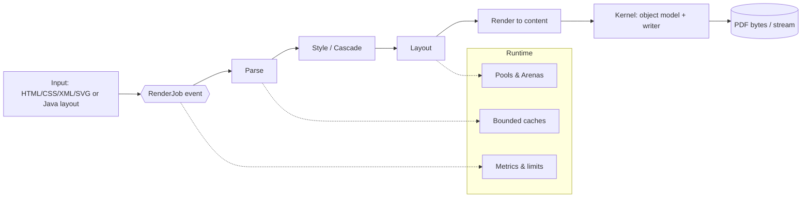
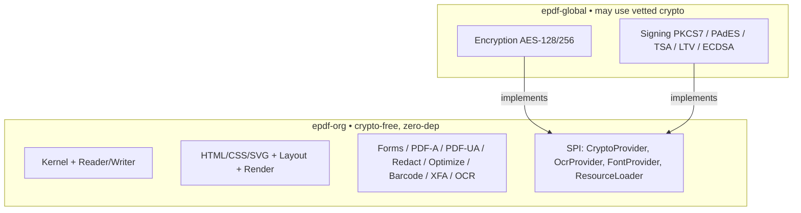

# 00 — Overview

## 0.1 Mission

`epdf-org` is a **clean-room, single-artifact PDF engine** that:

1. Renders **HTML/CSS/XML/SVG** (or a **programmatic Java layout**) to PDF with
   browser-grade fidelity (real cascade, floats, positioning, flex, grid, tables).
2. **Reads and manipulates** existing PDFs: merge, split, stamp, n-up, fill/flatten
   forms, redact, optimize, tag, flatten XFA.
3. Produces **compliant** output: PDF/A (A-1/2/3/4) and PDF/UA (full role map,
   reading order, Alt-text validation).
4. Is **safe and scalable** by construction: stateless engine, per-job context,
   event pipeline, bounded resources, GC-friendly data structures, no static
   mutable state.

## 0.2 Non-negotiable constraints

| # | Constraint | Consequence |
|---|---|---|
| C1 | **No third-party code or libraries** (even OSS) | Everything from the PDF/Unicode/W3C/ICC specs, original implementation |
| C2 | **Single JAR, single Maven module** | Users add one dependency, call one facade |
| C3 | **Permissive open-source (ePDF Engine License)** | No copyleft contamination; anyone may use/modify/redistribute with attribution; contributions welcome |
| C4 | **No cryptography in epdf-org** | Encryption/signing excluded; SPI hooks only; provided by `epdf-global` |
| C5 | **Package root `com.epdfengine.rb.org`** | Stable public namespace |
| C6 | **No bundled fonts** | User supplies fonts (files, `@font-face`, CSS font APIs); multi-font, multilingual |

## 0.3 The one-sentence architecture

> An **immutable, thread-safe engine** accepts a **RenderJob** (an event), runs it
> through a **staged pipeline** (parse → style → layout → render → assemble) that
> writes PDF objects through a **streaming kernel writer**, using **pooled buffers**
> and **bounded caches**, and returns a result — with **zero shared mutable state**
> between concurrent jobs.

## 0.4 epdf-org vs epdf-global

`epdf-org` never references a crypto implementation. It only declares the
interfaces; `epdf-global` supplies them at its own layer.

## 0.5 Reading order

New contributors: read [01-architecture.md](01-architecture.md) →
[02-kernel-object-model.md](02-kernel-object-model.md) →
[11-package-layout.md](11-package-layout.md), then the subsystem doc you plan to work on.
