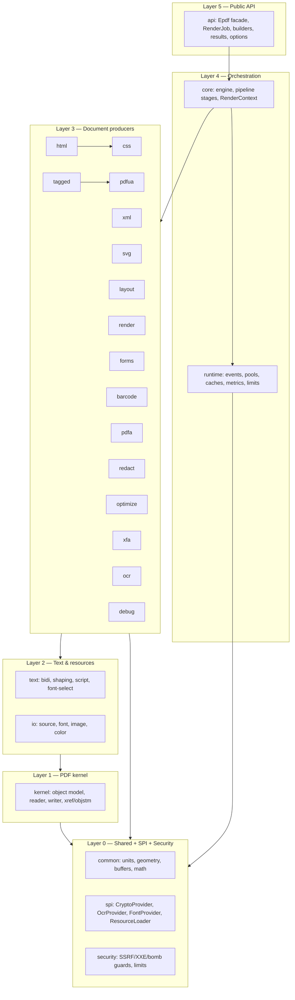
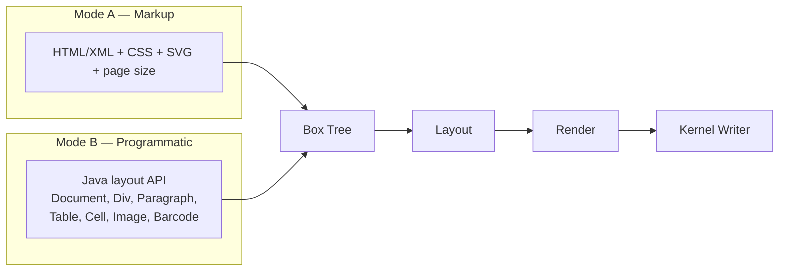
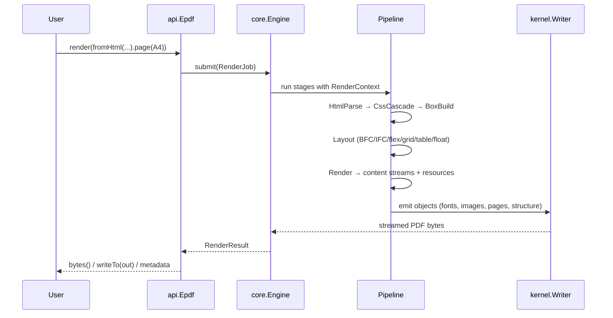

# 01 — Architecture

## 1.1 Layering

`epdf-org` is one jar, but internally it is strictly layered. **Dependencies point
downward only.** A higher layer may call a lower layer; the reverse is forbidden
(enforced by review and, later, by an ArchUnit-style in-house test).

### Layer responsibilities

| Layer | Packages | Owns |
|---|---|---|
| L5 API | `api` | The stable surface users call. Nothing else is public. |
| L4 Orchestration | `core`, `runtime` | Turns a job into stages; scheduling, pooling, caching, limits. |
| L3 Producers | `html css xml svg layout render forms barcode tagged pdfua pdfa redact optimize xfa ocr debug` | Build/transform document content. |
| L2 Text/Resources | `text io` | Fonts, images, colors, bidi, shaping. |
| L1 Kernel | `kernel` | PDF object graph, reader, writer, xref. |
| L0 Foundation | `common spi security` | Utilities, pluggability, safety. |

## 1.2 Two front doors, one pipeline

Users define layout **either** in markup **or** in Java. Both converge on the same
internal **Box Tree**, so there is exactly one layout+render path to maintain.

## 1.3 Data flow for HTML → PDF

## 1.4 Ports & adapters (SPI)

Everything epdf-org cannot or must not implement itself is a **port** in `spi`,
implemented by an **adapter** outside epdf-org (usually `epdf-global`):

| SPI port | Default in epdf-org | Adapter (epdf-global / host app) |
|---|---|---|
| `CryptoProvider` | none (throws "not available in org build") | AES/PKCS7/PAdES impl |
| `OcrProvider` | pass-through / no-op | trained OCR model |
| `FontProvider` | user-supplied files only | corporate font service |
| `ResourceLoader` | SSRF-safe default loader | host-controlled fetcher |

This keeps the crypto boundary (constraint C4) a **compile-time guarantee**:
epdf-org has no code path that performs cryptography.

## 1.5 State model (why it scales)

- The **engine is immutable and shared** across all threads/requests.
- All mutable per-request state lives in a **`RenderContext`** created per job.
- **No `static` mutable fields anywhere** (the #1 defect class in the previous
  library). Caches are engine-scoped instances, not statics.
- Scratch/hot allocations come from **per-context pools/arenas**, returned on
  completion, so steady-state allocation approaches zero.

See [07-scalability-runtime.md](07-scalability-runtime.md) for the full model.
