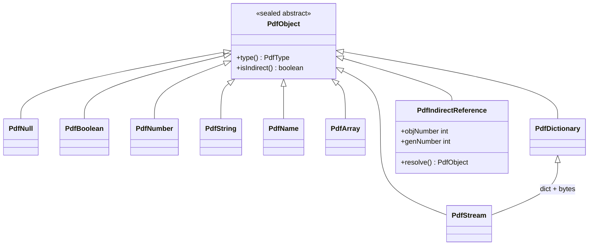
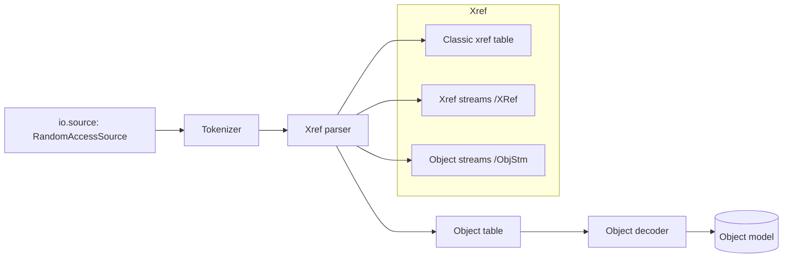
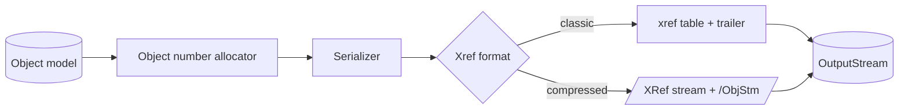

# 02 — Kernel: Object Model, Reader, Writer

The kernel is the foundation the previous library lacked: a **real PDF object
graph** with both a **reader** and a **writer**. This single decision unlocks
manipulation, merging, incremental update, tagging, optimization, and debugging.

## 2.1 Object model

Faithful to ISO 32000 §7.3. A sealed type hierarchy keeps it type-safe and
allocation-light.

Design notes:
- `PdfName` and small `PdfNumber`/`PdfBoolean` are **interned/flyweight** (shared
  immutable instances) to cut allocations on large documents.
- `PdfString` distinguishes **literal** vs **hex** and text vs byte semantics.
- `PdfStream` holds a lazily-decoded byte source; filters are applied on demand.
- Indirect references resolve through the owning `PdfDocument`'s object table.

## 2.2 Reader

Capabilities:
- **All xref forms**: classic tables, cross-reference streams (PDF 1.5+),
  compressed object streams `/ObjStm`.
- **Lazy loading**: objects are parsed on first access; the reader keeps a
  `RandomAccessSource` (array, file, or memory-mapped) so huge PDFs don't load
  fully into heap.
- **Recovery mode**: if the xref is broken, rebuild by scanning `N G obj`
  markers (bounded, with limits — see security).
- **Filters**: Flate, LZW, ASCII85, ASCIIHex, RunLength, DCT/JPXpassthrough. All
  decoders are guarded by decompression-bomb limits.

## 2.3 Writer

Capabilities:
- **Streaming**: objects are written to the target `OutputStream` as they are
  finalized; only cross-reference offsets are retained in memory. The whole PDF is
  **not** buffered in heap (unless a mode like linearization requires it).
- **Xref strategy is pluggable** (`Strategy` pattern): classic for maximum
  compatibility, compressed (`/XRef` + `/ObjStm`) for smallest size — the default
  for new documents.
- **Incremental update**: append a new section + updated xref without rewriting
  the file. This is the mechanism that later enables multi-revision workflows,
  form fill without full rewrite, and (in epdf-global) additional signatures.
- **Deterministic output** option for reproducible builds/tests.

## 2.4 Document facade

`kernel.PdfDocument` ties reader + writer + object table together:

| Operation | Method (illustrative) |
|---|---|
| Open existing | `PdfDocument.open(RandomAccessSource)` |
| Create new | `PdfDocument.create()` |
| Access page | `doc.page(int)` / `doc.pages()` |
| Add/import object | `doc.add(PdfObject)` / `doc.importObject(src, ref)` |
| Merge | `doc.append(otherDoc, pageRange)` |
| Save | `doc.writeTo(out, WriteOptions)` |
| Incremental save | `doc.appendTo(existingBytes, out)` |

## 2.5 Why this is memory-safe at scale

- Reader is **lazy + source-backed** → open a 500 MB PDF using a few MB of heap.
- Writer is **streaming** → produce a 500 MB PDF using a few MB of heap.
- Object model uses **flyweights** for names/small scalars and **arenas** for the
  short-lived objects created during a single render.
- Every decoder enforces **output-size and ratio caps** (bomb defense).

See [07-scalability-runtime.md](07-scalability-runtime.md) and
[08-security.md](08-security.md).
