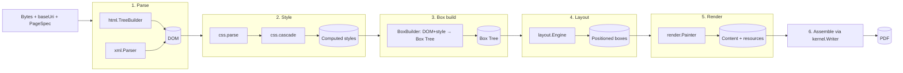
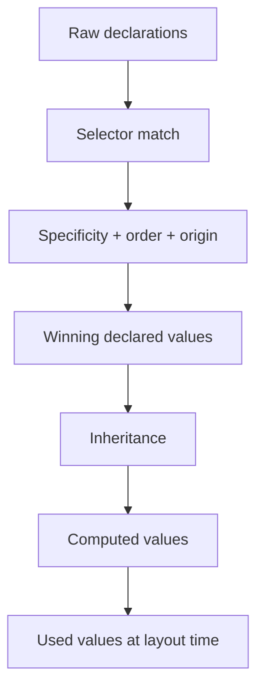

# 03 — Pipeline: HTML / CSS / XML / SVG → PDF

## 3.1 Stages

Every markup render is a fixed sequence of pure-ish stages. Each stage has a
single responsibility and a typed input/output, so stages are independently
testable and swappable.

## 3.2 Parsers (spec-guided, safe)

| Parser | Standard | Safety |
|---|---|---|
| `html.TreeBuilder` | HTML5 tokenizer + tree construction (subset, error-tolerant) | No script execution; bounded nesting |
| `xml.Parser` | XML 1.0, namespace-aware | **No external entities (XXE-proof)**; entity-expansion cap |
| `css.parse` | CSS Syntax Level 3 tokenizer | Bounded declaration/selector counts |
| `svg` | SVG 1.1/2 subset → **vector** ops | Same loader/limits as CSS/HTML |

Unlike the previous engine's tag-soup + regex CSS, this pipeline uses a proper
**tokenizer → tree** for HTML and a **tokenizer → parser → cascade** for CSS.

## 3.3 CSS cascade (the fidelity lever)

The cascade is the single biggest driver of "looks exactly like the browser".

Selector engine (`css.select`) supports, at minimum:
- Type, class, id, universal, attribute selectors (`[k]`, `[k=v]`, `~=`, `|=`, `^=`, `$=`, `*=`).
- Combinators: descendant (space), child `>`, adjacent `+`, general sibling `~`.
- Compound selectors and **correct specificity** (a,b,c triple).
- Structural pseudo-classes: `:first-child`, `:last-child`, `:nth-child()`,
  `:nth-of-type()`, `:only-child`, `:not()`.
- Pseudo-elements used in print: `::before`, `::after`, `::marker`.
- Origins & `!important` ordering (UA < user < author < author-important).

## 3.4 Value & unit model (`css.value`)

Typed values, not strings: `Length` (px/pt/em/rem/%/vw/vh/ch), `Color` (named,
hex, rgb/rgba, hsl/hsla), `Gradient` (linear/radial/conic), `BorderRadius`,
`Shadow`, `Transform`, `FontShorthand`, `BackgroundShorthand`. Each type knows how
to **resolve** against a context (font size, viewport, containing block).

## 3.5 SVG as vector (not raster)

`svg` builds an SVG DOM and emits **PDF vector operators** (paths, fills, strokes,
gradients, clips, text) directly into the content stream via `render` — so output
is resolution-independent, unlike the previous raster-to-bitmap approach.

Supported: `path rect circle ellipse line polyline polygon g text tspan
image use defs linearGradient radialGradient clipPath` with transforms,
`fill/stroke`, opacity, dash, line caps/joins, `viewBox`/`preserveAspectRatio`.

## 3.6 Contract between stages

- Stages communicate through **immutable value objects** (DOM node, ComputedStyle,
  Box, PositionedBox). No stage mutates a previous stage's output.
- The only shared, mutable thing is the **`RenderContext`** (buffers, caches,
  metrics, limits) — and it is confined to a single job/thread.
