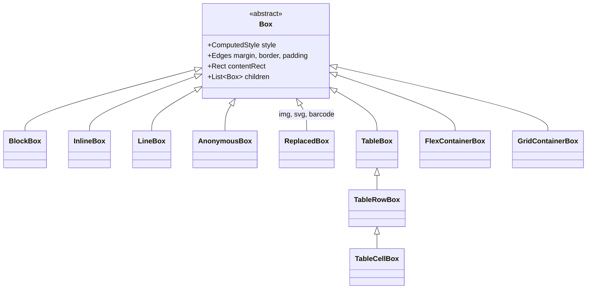
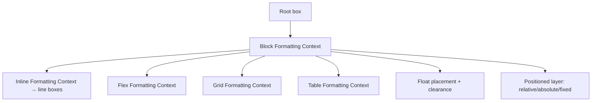
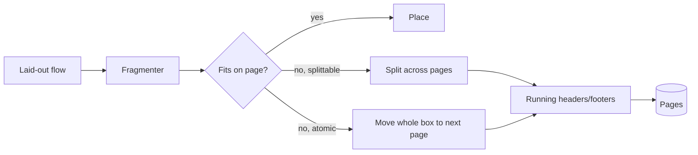
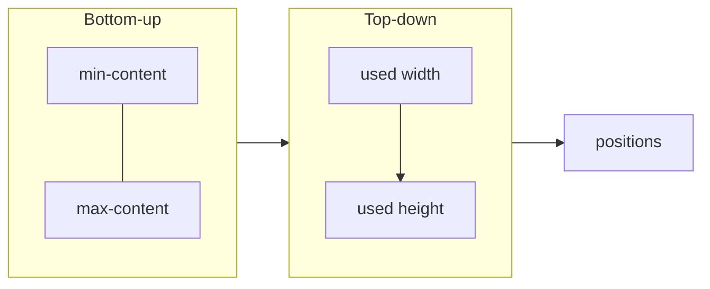

# 04 — Layout Engine

The layout engine converts a **Box Tree** (from markup or the Java API) into
**positioned boxes** with page breaks, ready for the painter. It implements the
CSS visual formatting model to the depth a print/report engine needs.

## 4.1 Box model



## 4.2 Formatting contexts



| Context | Handles |
|---|---|
| **BFC** | Vertical stacking, margin collapsing, clearance |
| **IFC** | Line breaking, baseline alignment, inline-block, `white-space`, text-align/justify |
| **Flex** | `flex-direction/wrap`, grow/shrink/basis, `justify/align`, gaps |
| **Grid** | Track sizing (`fr`, `min/max-content`, `repeat`, `minmax`), placement, spans, areas, subgrid |
| **Table** | Auto/fixed algorithm, shared column widths, row equalization, vertical-align, collapsed borders |
| **Float** | Left/right floats, wrap-around, `clear` |
| **Position** | `relative` offsets; `absolute/fixed` against containing block; `z-index` stacking |

These four items (**float**, **absolute/fixed**, **real margin collapsing**,
**fragmentation**) are the gaps called out in the previous engine; they are
first-class here.

## 4.3 Pagination & fragmentation



- True **fragmentation**: a tall block/table/row can split across pages (the
  previous engine could only push whole blocks).
- `break-before/after/inside`, `orphans`, `widows`, `break-inside: avoid`.
- **Paged media**: `@page` size/margins, margin boxes, running headers/footers,
  `counter(page)`/`counter(pages)`, named pages.
- Repeating table headers (`thead`) on each page fragment.

## 4.4 Sizing algorithm

Two-phase, cache-backed:

1. **Intrinsic sizing** — min-content / max-content widths computed bottom-up and
   **memoized per box** (avoids the O(n²) re-measure the old engine suffered).
2. **Used sizing** — top-down resolution against containing blocks, then height.



Intrinsic results are stored on the box (not in a side `IdentityHashMap` that
leaks across jobs — a defect in the previous engine). All per-layout scratch state
lives on a **`LayoutContext`** owned by the job.

## 4.5 Programmatic layout (Mode B)

The same box tree can be built directly in Java, mirroring the markup model:

```
Document doc = Document.of(PageSpec.A4).margins(36);
doc.add(Paragraph.of("Invoice").fontSize(20).bold());
doc.add(Table.columns(3)
        .header("Item", "Qty", "Price")
        .row("Widget", "2", "9.99"));
doc.add(Barcode.qr("https://example.org/inv/42"));
```

`Document`, `Div`, `Paragraph`, `Text`, `Image`, `Table/Row/Cell`, `List`,
`Barcode`, `SvgGraphic`, `Spacer`, `PageBreak` all produce `Box` nodes and flow
through the identical layout + render path. See [06-public-api.md](06-public-api.md).

## 4.6 Thread-safety

- `LayoutEngine` holds **no mutable fields**; all state is passed in a
  `LayoutContext`.
- Column-width overrides, row-height equalization, and forced widths are stored on
  the `LayoutContext`, not as engine instance fields — so one engine instance
  serves unlimited concurrent jobs safely.
