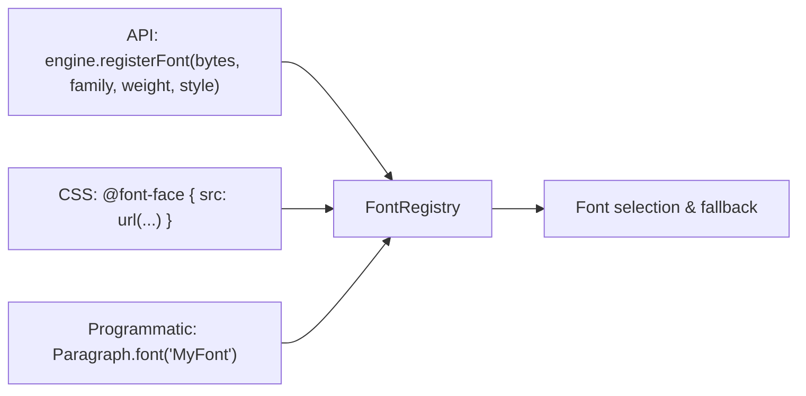
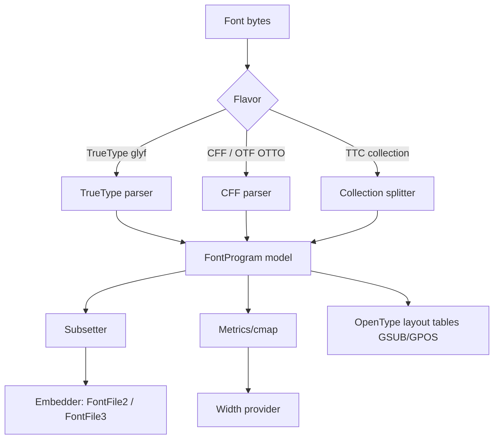
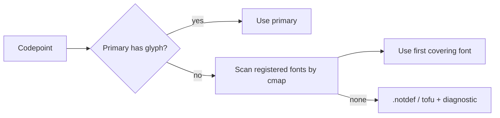

# 05 — Fonts, Text Shaping & International Scripts

## 5.1 Policy: no bundled fonts

`epdf-org` ships **zero fonts**. The user always supplies the font program
(TTF/OTF/TTC/WOFF-unpacked bytes). This keeps the jar small, avoids font
licensing questions, and lets each document use exactly the faces it needs.

Fonts can be provided three ways, all equivalent internally:

- **Multi-font**: any number of families/weights/styles per document.
- **Per-region fonts**: different runs/pages/elements can use different fonts via
  CSS or the Java API.
- **CSS font APIs**: `font-family`, `font-weight`, `font-style`, `@font-face`,
  `src: url(...)`, `unicode-range`, `font-feature-settings`.
- **Custom loader**: `src: url(...)` is fetched through the SSRF-safe
  `ResourceLoader` SPI (host app controls access).

## 5.2 Font subsystem (`io.font` + `text.font`)

Improvements over the previous engine:
- **CFF/OpenType (`OTTO`) embedding** (the old engine rejected these) → CIDFontType0.
- **TrueType** → CIDFontType2 with real glyf/loca **subsetting**.
- **TTC** collections supported.
- Width arrays and descriptors always in 1000-em glyph space (correct spacing).
- Font programs are **cached** (see runtime) keyed by content hash, so the same
  corporate font isn't re-parsed per request.

## 5.3 International text pipeline (`text`)

The path from a Unicode string to positioned glyphs:

| Component | Standard | Purpose |
|---|---|---|
| `text.bidi` | UAX #9 | Mixed LTR/RTL (Arabic, Hebrew) ordering |
| `text.shape` | OpenType GSUB/GPOS | Ligatures, contextual forms, marks |
| Arabic shaper | Joining types | Initial/medial/final/isolated forms |
| Indic/Thai shaper | Script rules | Reordering, cluster formation |
| CJK | Wide metrics, CID | Chinese/Japanese/Korean |
| `line break` | UAX #14 | Break opportunities incl. CJK, no-break |

Result: **Arabic, Hebrew, Chinese, Japanese, Korean, Thai, Devanagari** render
correctly, provided the user supplies a font with the needed glyphs.

## 5.4 Font fallback

When the primary font lacks a codepoint, `text.font` selects a fallback from the
registered set by coverage (cmap), producing **mixed-font runs** in a single line.
Width measurement uses the same selection so layout and painting stay aligned.

## 5.5 What the user must provide for a language

| Language | User supplies |
|---|---|
| Latin/European | Any Latin TTF/OTF |
| Arabic/Hebrew | Font with Arabic/Hebrew glyphs + GSUB/GPOS |
| CJK | A CJK font (large; subsetting keeps output small) |
| Thai/Indic | Script-capable font with shaping tables |

epdf-org does the **shaping and ordering**; the user owns the **glyphs**.

## 5.6 CJK / Asian text — implementation approach

epdf-org handles Chinese/Japanese/Korean the **modern, self-contained** way:
**embed + subset the user-supplied CJK font** and write text with **Identity-H**
encoding plus a `ToUnicode` CMap. This needs **no external CMap resource files**
and produces portable PDFs that render anywhere.

Note on predefined CMaps (legacy path): some libraries reference *non-embedded*
Adobe-GB1/CNS1/Japan1/Korea1 fonts via predefined CMaps (e.g. `UniGB-UCS2-H`).
epdf-org does **not** need this. If a predefined-CMap mode is ever added, the CMap
resource files must be sourced from **Adobe's own permissive repository**
(`adobe-type-tools/cmap-resources`, BSD-3-Clause) and bundled in **epdf-global** —
**never copied from iText's `font-asian` module, which is AGPL.** See
[12-licensing-and-boundaries.md](12-licensing-and-boundaries.md).
