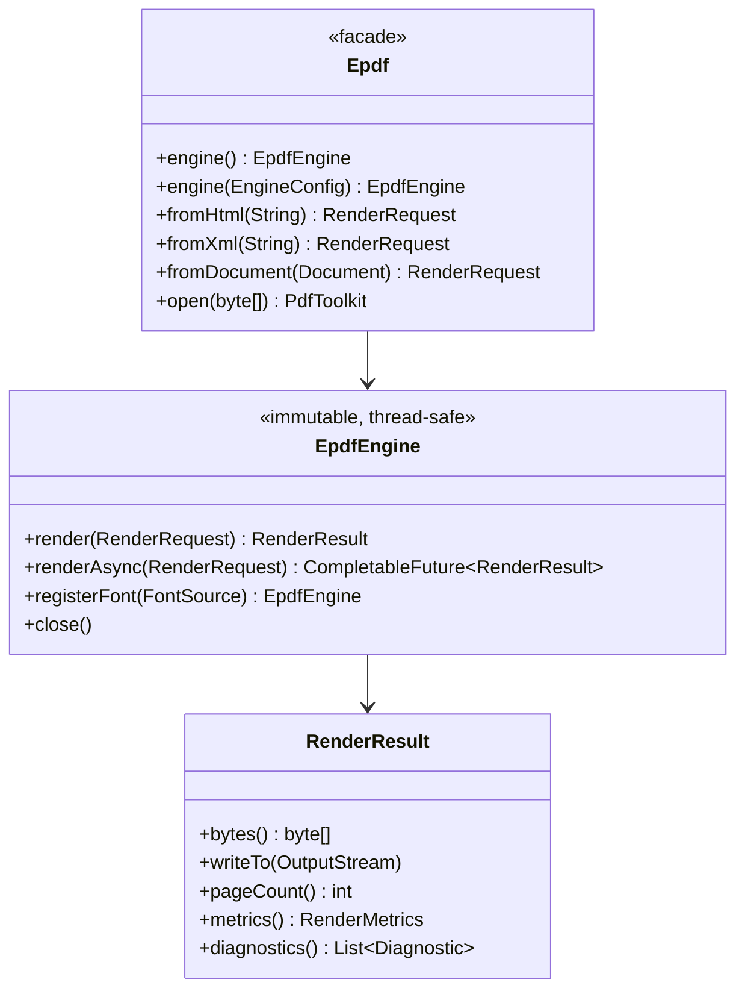

# 06 — Public API (the surface users call)

The public API is small and stable. Everything else is internal. Users add **one
dependency** and import from **one package**: `com.epdfengine.rb.org.api`.

> **Implemented API (current):** the engine facade is
> `com.epdfengine.rb.org.runtime.Epdf` (`Epdf.create()`); a render is
> `RenderRequest.of(html)` (Mode A) or `RenderRequest.of(document)` (Mode B,
> `com.epdfengine.rb.org.api.doc`); the toolkit is static helpers (`PdfMerger`,
> `PdfOptimizer`, `Linearizer`, `FormFiller`, `Redactor`). The `Epdf.fromHtml(...)` /
> `EpdfEngine` / `PdfToolkit` names below are the original design sketch — see
> **[EPDF-ORG-COMPLETE-GUIDE.md](EPDF-ORG-COMPLETE-GUIDE.md)** and
> **[15-mode-a-and-mode-b-syntax.md](15-mode-a-and-mode-b-syntax.md)** for the real
> signatures.

## 6.1 Facade



## 6.2 Mode A — layout defined in markup

Page geometry and layout come from HTML/XML + CSS (`@page`, sizes, everything):

```java
EpdfEngine engine = Epdf.engine();               // shared, thread-safe, reusable

byte[] pdf = engine.render(
        Epdf.fromHtml(html)
            .baseUri("classpath:/templates/")
            .page(PageSpec.A4)                    // or read @page from CSS
            .taggedPdf(true)                      // PDF/UA structure
            .pdfA(PdfAConformance.A2B)
        ).bytes();
```

## 6.3 Mode B — layout defined in Java

No markup; build the document with a fluent, browser-like model:

```java
Document doc = Document.of(PageSpec.A4).margins(Edges.of(36));
doc.header(Running.centered(Text.pageNumber()));
doc.add(Paragraph.of("Invoice #42").fontSize(20).bold());
doc.add(Table.columns("50%", "25%", "25%")
        .header("Item", "Qty", "Amount")
        .row("Widget", "2", "$9.99")
        .row("Gadget", "1", "$19.99"));
doc.add(Barcode.qr("https://example.org/inv/42").size(72));

byte[] pdf = engine.render(Epdf.fromDocument(doc)).bytes();
```

Both modes converge on the same Box Tree → identical layout/render path.

## 6.4 Manipulation toolkit (existing PDFs)

```java
try (PdfToolkit tk = Epdf.open(existingPdfBytes)) {
    tk.merge(Epdf.open(other));          // combine
    tk.pages().keep(1, 3, 5);            // subset
    tk.stamp(page, watermark);           // overlay
    tk.forms().fill(Map.of("name","Ada")).flatten();
    tk.redact(Region.of(page, rect));    // pdfSweep-style
    tk.optimize(OptimizeOptions.max());  // obj/xref streams, image recompress, dedup
    tk.tagForAccessibility();            // PDF/UA
    tk.writeTo(out);
}
```

## 6.5 Async / event model (scale)

```java
CompletableFuture<RenderResult> f = engine.renderAsync(request);
f.thenAccept(r -> store(r.bytes()));
```

Each call is one **RenderJob event** submitted to the engine's bounded executor.
See [07-scalability-runtime.md](07-scalability-runtime.md).

## 6.6 Configuration

```java
EpdfEngine engine = Epdf.engine(EngineConfig.builder()
        .workerThreads(Runtime.getRuntime().availableProcessors())
        .maxQueue(10_000)
        .fontCacheBytes(64 * 1024 * 1024)
        .imageCacheBytes(128 * 1024 * 1024)
        .resourceLoader(myLoader)                 // SSRF policy / host control
        .limits(RenderLimits.builder()
                .maxInputBytes(20 * 1024 * 1024)
                .maxPages(5_000)
                .maxWallClock(Duration.ofSeconds(30))
                .build())
        .cryptoProvider(CryptoProvider.NONE)      // org build: crypto disabled
        .build());
```

## 6.7 API design rules

- **One facade** (`Epdf`), one engine type, small result type.
- **Immutability**: `EpdfEngine` and requests are immutable; `renderAsync` is safe
  to call from any number of threads.
- **No checked-exception noise**: failures surface as `EpdfException` plus a
  `diagnostics()` list explaining dropped fonts/images/unsupported CSS.
- **Fluent builders** for requests, documents, and config.
- **Resource-safe**: `EpdfEngine` and `PdfToolkit` are `AutoCloseable`.
