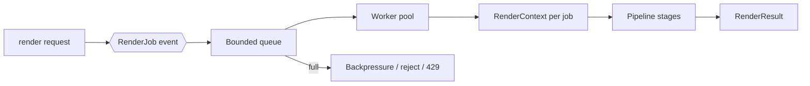
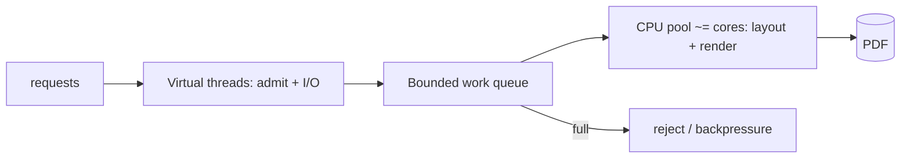
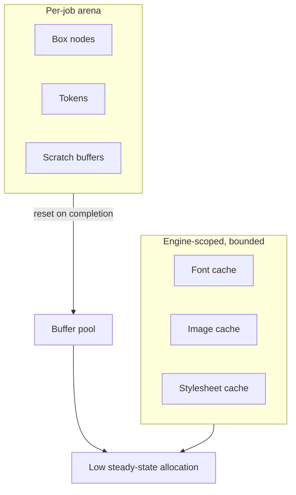
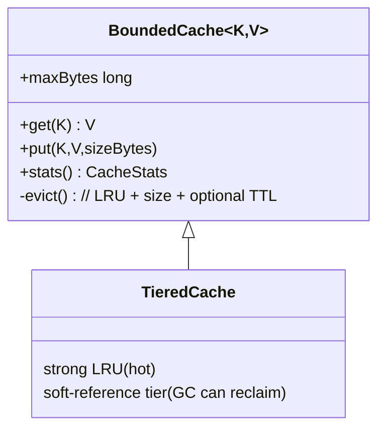
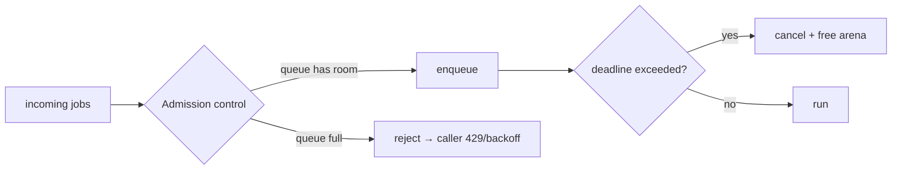
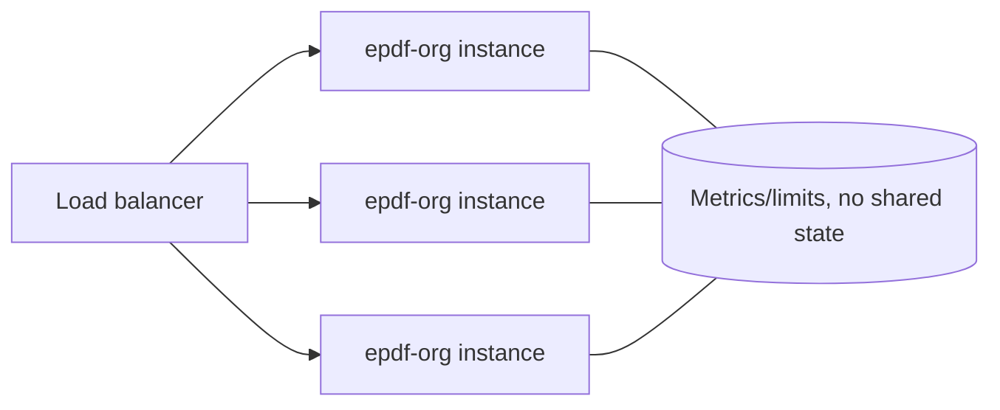

# 07 — Scalability & Runtime (1M requests)

Goal: a **self-sufficient, embeddable engine** that stays fast and memory-stable
whether it runs inside Spring Boot, AEM, a plain servlet, a CLI batch, or a
serverless function — without leaning on the host framework for correctness.

## 07.1 Core principle: one generation = one event



- A job carries its input, options, deadline, and a **`RenderContext`** (its
  private scratch space, caches views, metrics, and limits).
- Jobs are **independent**: no job can observe or corrupt another's state.
- The engine exposes both sync (`render`) and async (`renderAsync`) entry points;
  async returns a `CompletableFuture` so hosts integrate naturally.

### Java 21 virtual threads (I/O) + CPU pool (render)

PDF rendering is **CPU-bound**; virtual threads help **I/O concurrency**, not CPU
parallelism. So the engine combines both:
- **Virtual threads** (Java 21, stable) handle admission, request I/O, and remote
  resource fetches — millions can block cheaply without pinning OS threads.
- A **bounded CPU worker pool sized ≈ available cores** runs the actual
  layout/render so CPU work never oversubscribes the machine.



## 07.2 No shared mutable state (the correctness foundation)

| Old library defect | epdf-org rule |
|---|---|
| `static volatile SecurityPolicy` set per request | Policy is **per-job**, carried in `RenderContext` |
| `static` resource cache shared across tenants | Caches are **engine-instance** scoped, optionally per-tenant |
| Layout engine instance fields (`IdentityHashMap`) mutated during layout | All layout scratch in **`LayoutContext`** owned by the job |
| Whole PDF buffered twice in heap | **Streaming** writer; buffer only when a mode requires it |

This is enforced by an in-house architecture test that **fails the build on any
`static` non-final field** in production packages.

## 07.3 Memory & GC strategy



Techniques:
- **Arena / region allocation** for the many short-lived objects created per
  render (box tree, tokens). The whole arena is dropped/reset at job end, turning
  thousands of tiny allocations into one bulk reclaim — friendly to G1/ZGC.
- **Object & byte-buffer pools** (`runtime.pool`) for reusable scratch (content
  builders, glyph buffers, deflate buffers). Pools are bounded and drop excess.
- **Flyweights** for `PdfName`/small numbers and for repeated CSS values.
- **Streaming** everywhere: reader is source-backed and lazy; writer emits to the
  `OutputStream` incrementally. Peak heap is ~O(page working set), not O(document).
- **No finalizers**; `AutoCloseable` + try-with-resources; explicit pool return.
- **Primitive-specialized structures** (int arrays, open-addressing int maps) on
  hot paths to avoid boxing and pointer chasing.

## 07.4 Caches (`runtime.cache`)



- **Byte-bounded LRU** (not entry-count) so a few huge images can't blow the heap.
- Optional **TTL** and **per-tenant partitioning** to prevent cross-tenant reuse
  or leakage.
- A **soft-reference second tier** lets the JVM reclaim cache under pressure
  instead of OOM.
- Keys are **content hashes** (fonts/images) so identical assets dedupe across
  requests.
- Every cache emits **stats** (hits/misses/evictions/bytes) via `runtime.metrics`.

## 07.5 Backpressure & load shedding



- **Bounded queue + rejection policy**: under overload the engine sheds load
  deterministically instead of degrading everyone (protects tail latency).
- **Per-job deadline** (`maxWallClock`): a runaway document is cancelled and its
  arena freed — one bad input cannot exhaust the pool.
- **Fairness**: optional per-tenant queues/quotas so one tenant can't starve
  others.

## 07.6 Worst-case scenario handling

| Scenario | Defense |
|---|---|
| 50 MB HTML with millions of nodes | `maxInputBytes`, `maxDomNodes`, bounded nesting |
| Decompression bomb in an imported PDF | Ratio + absolute output caps on every filter |
| Font with 65k glyphs | Subsetting + font cache; width maps primitive-int |
| Pathological CSS (deep selectors) | Selector count/complexity caps; matching is O(depth) |
| Infinite `@page`/counter loops | Page-count limit; fragmenter guards |
| Huge image | Max dimensions/pixels; downscale or reject |
| Slow remote resource | Connect/read timeouts; total resource budget per job |

## 07.7 Horizontal scale & host integration

- The engine is **stateless across requests**, so N instances behind a load
  balancer need **no shared session** — scale out linearly.
- **Warm-up hook** pre-parses/pins hot fonts and templates to avoid cold-start
  spikes.
- **Metrics** (`runtime.metrics`) expose counters/timers/gauges the host can
  publish to Micrometer/Prometheus (via a thin adapter the host writes — epdf-org
  stays dependency-free).
- **Graceful shutdown**: drain the queue, finish in-flight jobs, release pools.



## 07.8 Capacity model (rule of thumb)

Throughput ≈ `workerThreads / avgRenderSeconds`. For 1M requests/day (~12/s
average, plan for 5–10× peak): a handful of instances each with CPU-count workers,
byte-bounded caches sized to the working set, and admission control tuned so p99
stays flat under burst. The engine's job is to make each render **cheap, bounded,
and independent** — the numbers then follow from horizontal scale.

## 07.9 Concurrency building blocks (JDK-based)

We surveyed a mature library's `commons` module for its concurrency approach
(reference only — that code is copyleft and was **not** copied). Finding: it keeps
concurrency **minimal**, building straight on the JDK's `java.util.concurrent` —
a concurrent set, a concurrent **weak-key** map (GC-reclaimable cache), a
fixed-thread-pool "run these callables in parallel" helper, a thread-safe DI
container, `AtomicLong` counters, and a thread-safe statistics aggregator. It has
**no** bounded queue, backpressure, pooling, or arenas.

Decision for epdf-org (the JDK's `java.util.concurrent` is standard library, not a
third-party dependency, so it is allowed):

| Building block | Source | Use |
|---|---|---|
| `ConcurrentHashMap`, `ExecutorService`, `Future`, `AtomicLong` | JDK, used directly | caches, job pool, counters/ids |
| **Byte-bounded LRU** + **soft/weak-reference tier** | our own (`runtime.cache`) | font/image/stylesheet caches that shed under memory pressure |
| **Bounded worker pool (~cores)** + **virtual threads for I/O** | our own (`runtime.event`) on Java 21 | CPU-bound render vs. I/O concurrency |
| `AtomicLong` job ids + kernel object numbering | JDK | identity/counters |
| Thread-safe **metrics aggregator** | our own (`runtime.metrics`) | counters/timers/gauges |
| **Backpressure** (bounded queue + rejection), **per-job deadlines**, **object/byte-buffer pools**, **arenas** | our own — the differentiators | predictable behaviour under overload |

In short: **use JDK primitives for the low-level pieces** (as the surveyed library
does), and add the **admission-control + pooling + bounded-cache** layer on top —
which is what carries us to the 1M-request target and is exactly what a bare
`commons`-style utility set does not provide.

## 07.10 JVM baseline flags, GC choice & stack

The engine is dependency-free and holds no per-request static state, so tuning is
about **heap sizing + GC pause target + thread/stack budget**. Pick by workload.

**Heap** — fix the size to avoid resize pauses; size = working set + cache budget + headroom:

```
-Xms2g -Xmx2g               # fixed heap (no grow/shrink pauses)
-XX:+AlwaysPreTouch          # touch pages up front → steady tail latency
-XX:MaxMetaspaceSize=256m    # bound class metadata
# containers: prefer a percentage so the JVM respects cgroup limits
-XX:MaxRAMPercentage=75
```

**GC — choose by SLA:**

| Workload | GC | Flags |
|---|---|---|
| Latency-sensitive service (1M req, low p99) | **Generational ZGC** (sub-ms pauses, large heap) | `-XX:+UseZGC -XX:+ZGenerational` |
| Balanced default | **G1** | `-XX:MaxGCPauseMillis=100 -XX:+UseStringDeduplication` |
| Batch / CLI throughput | **Parallel** | `-XX:+UseParallelGC` |

`-XX:+UseStringDeduplication` (G1) pays off here — CSS values, `PdfName`s and font
names repeat heavily. epdf-org keeps steady-state allocation low (per-coordinate
formatter is allocation-light, streaming writer keeps peak heap ≈ page working set),
so any modern collector stays out of the way.

**Threads & stack:**
- The **CPU pool ≈ cores**, so few platform threads exist → their ~512 KB–1 MB
  stacks are negligible. No need to shrink `-Xss`.
- **Virtual threads** (I/O) have cheap, heap-backed growable stacks — millions can
  block without OS threads. The I/O path avoids `synchronized` around blocking calls
  so carriers never pin.
- Layout recursion depth = DOM/box nesting depth; it is **bounded by input limits**
  (`maxNestingDepth`) so deeply-nested hostile HTML cannot cause `StackOverflowError`.
  Prefer iterative passes for the unbounded dimensions (page fragmentation, run
  building).

**Memory-aware shedding:** `RuntimeStats.snapshot()` exposes heap/GC/thread state;
a host polls `heapUsedRatio()` (or `underMemoryPressure(0.85)`) and starts rejecting
new jobs *before* the heap is exhausted — turning a would-be `OutOfMemoryError` (and
the cascading CPU thrash of back-to-back full GCs) into a clean 503 + backoff.

## 07.11 How this compares (concurrency & scalability)

Honest, factor-by-factor scorecard vs. a mature incumbent (feature reference only,
no code copied). ✅ = epdf-org ahead · ⚖️ = par · ⬜ = incumbent ahead / our gap.

| Factor | Incumbent approach | epdf-org | Verdict |
|---|---|---|---|
| Document thread-safety | `PdfDocument` **not** thread-safe → one per thread, app's problem | Stateless engine; per-job `RenderContext`; **zero** mutable static state | ✅ |
| Admission control at 1M req | none built in — you wire your own pool/queue (an unbounded pool/queue can OOM or thrash CPU) | Built-in **bounded pool + bounded queue + reject/backpressure** | ✅ |
| CPU saturation / "crash at a million" | depends on app's pool; easy to oversubscribe | CPU pool **sized ≈ cores**; excess is queued then shed — CPU never oversubscribes | ✅ |
| I/O concurrency | blocking on platform threads (Java 8 compat) | **Java 21 virtual threads** for fetch/decode — millions block cheaply, no pinning | ✅ |
| Per-job deadline / cancellation | app-managed | Built-in deadline + cooperative cancel + arena free | ✅ |
| Cache memory safety | global font cache (unbounded-ish, count-based) | **byte-bounded LRU** (+ soft-ref tier planned) → a few huge assets can't blow heap | ✅ (memory) |
| Automatic font-program reuse | mature **global** font cache | resource-byte cache; font-program cache not yet global | ⬜ (our gap → #10 soft tier / font cache) |
| Peak heap per render | streams to `OutputStream` | streams too; peak ≈ page working set | ⚖️ |
| Number formatting speed | custom (not `String.format`) | custom hand-rolled, **9.5× vs `String.format`**, byte-identical | ⚖️ |
| Decompression-bomb / input caps | reader memory-limit handler | `ResourceLimits` (size/pixels/timeout) per job | ⚖️ |
| Output size (compression) | **/ObjStm + xref streams** by default | classic xref today | ⬜ (our gap → **#13**) |
| Image/font/content dedup | present | planned | ⬜ (our gap → **#14**) |
| Java version reach | Java 8+ (broad legacy reach) | Java 21 (records/sealed/virtual threads) | ⚖️ (trade: modernity vs legacy) |

**Summary:** epdf-org is **ahead on the things that decide survival at a million
requests** — built-in admission control, backpressure, CPU-bounded execution,
virtual-thread I/O, per-job isolation with no static state, and byte-bounded caches
that shed under memory pressure. We are **at par** on streaming, number-format speed
and input safety. The incumbent is still **ahead on output compression (`/ObjStm`,
tracked as #13), image/font dedup (#14) and a mature global font-program cache** —
these are known, scoped gaps, not architectural ones. So: *more optimized for
scale/concurrency/memory-safety; not yet for output size* — and closing that is the
next optimize milestone.
