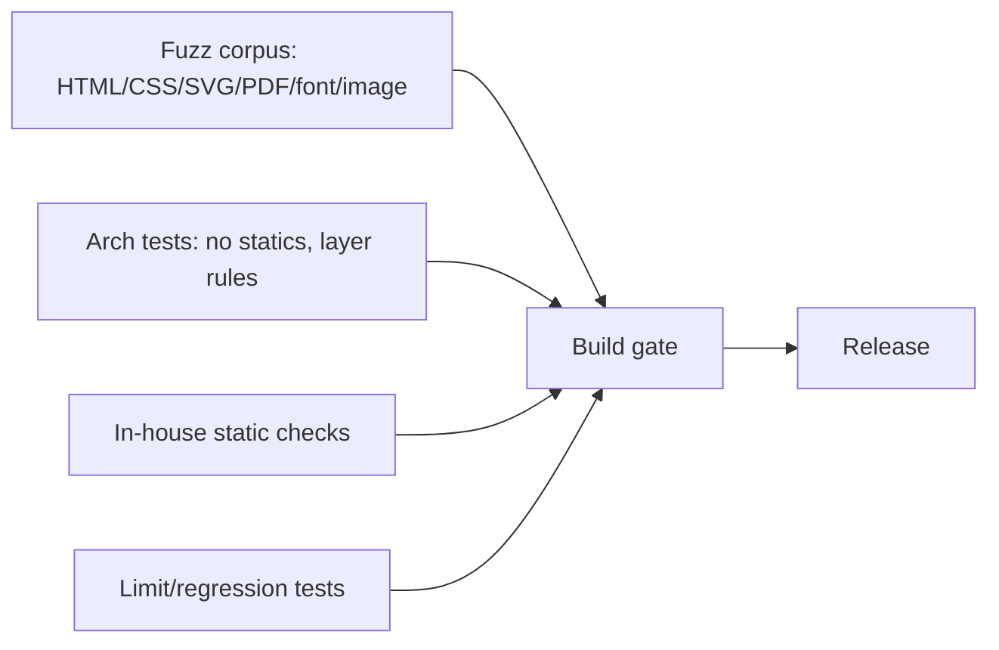

# 08 — Security & Vulnerability Management

Security is a **design property**, not a feature bolted on. Because the whole
engine is original code with no third-party attack surface, the remaining risk is
in **untrusted input** (HTML/CSS/SVG/XML, fonts, images, and imported PDFs) and
**resource fetching**. Each is contained below.

## 08.1 Threat model

```mermaid
flowchart TB
    U[Untrusted input] --> HTML[HTML/CSS/SVG/XML]
    U --> PDFIN[Imported PDF]
    U --> ASSET[Fonts / images]
    U --> URLS[Remote url() references]
    HTML --> V1[XXE / entity expansion]
    HTML --> V2[Billion laughs / deep nesting]
    PDFIN --> V3[Decompression bombs]
    PDFIN --> V4[Malformed xref / infinite loops]
    ASSET --> V5[Malformed font/image parsers]
    URLS --> V6[SSRF / metadata / internal hosts]
```

## 08.2 SSRF-safe resource loading (`security` + `spi.ResourceLoader`)

The previous engine had two SSRF holes (main URL bypassed policy; redirects
followed blindly). Both are closed by design:

```mermaid
flowchart LR
    REQ[url()] --> POL{Allowed by policy?}
    POL -->|host allowlist| RES[Resolve DNS]
    RES --> IPCHK{IP public & not blocked?}
    IPCHK -->|no| DENY[Deny]
    IPCHK -->|yes| PIN[Pin resolved IP]
    PIN --> CONN[Connect no-auto-redirect]
    CONN --> RED{Redirect?}
    RED -->|yes| POL2[Re-validate hop against policy]
    RED -->|no| READ[Read with size+time caps]
```

Rules:
- **Every** fetch (including the top-level document URL) goes through the same
  policy — no bypass path.
- **No blind redirects**: auto-redirect off; each hop re-validated.
- **Block private/link-local/metadata ranges** (`10/8`, `172.16/12`, `192.168/16`,
  `127/8`, `169.254/16`, `::1`, `fc00::/7`, IPv4-mapped) unless explicitly allowed.
- **Pin the resolved IP** for the connection to defeat DNS-rebinding TOCTOU.
- **Host allowlist**, connect/read timeouts, and a **per-job total byte budget**.
- Schemes: `data:` (size-capped), `classpath:` (opt-in), `file:` (opt-in, path
  jailed), `http/https` (policy-gated). Everything else denied.

## 08.3 XML/HTML hardening

- **XXE-proof**: the XML parser has **no external entity resolution** and no DTD
  fetching — external/parameter entities are not processed at all.
- **Entity-expansion cap** (billion-laughs): total expanded size and depth are
  bounded.
- **Nesting depth** and **node count** caps on HTML/XML/CSS.
- **No script execution**, no `javascript:` URLs, no event handlers acted upon.

## 08.4 Decompression & parser bombs

- Every stream filter (Flate/LZW/RunLength/ASCII85/Hex) enforces both an
  **absolute output cap** and a **max expansion ratio**.
- Image decoders cap **pixel count** and **dimensions** before allocating.
- Font parsers validate table bounds before every read (no OOB) and reject
  inconsistent `loca`/`glyf`.
- PDF reader **xref recovery** is bounded (max scan, max objects) so a malformed
  file cannot loop or exhaust memory.

## 08.5 Resource limits (`RenderLimits`)

| Limit | Default (tune per deployment) |
|---|---|
| `maxInputBytes` | 20 MB |
| `maxDomNodes` | 1,000,000 |
| `maxNestingDepth` | 512 |
| `maxPages` | 5,000 |
| `maxImagePixels` | 40 MP |
| `maxDecompressedBytes` | 200 MB |
| `maxResourceFetchBytes` | 32 MB/job |
| `maxWallClock` | 30 s |

A job that trips any limit fails fast with a precise `Diagnostic`, freeing its
arena immediately.

## 08.6 Crypto boundary (constraint C4)

- epdf-org contains **no cryptographic code** — nothing to audit for crypto CVEs.
- `spi.CryptoProvider` is the only seam; the default is `NONE` and any call to an
  unset provider throws a clear "not available in org build" error.
- This makes "does the org build do crypto?" answerable by grep: it does not.

## 08.7 Secure-by-default coding rules

- No `Runtime.exec`, no reflection driven by input, **no Java serialization**.
- All parsing validates at the boundary; internal code trusts typed models.
- Immutable value objects prevent tampering across stages.
- Diagnostics never echo secrets; errors are structured, not string-concatenated
  from input.
- Deterministic, side-effect-free stages ease fuzzing.

## 08.8 Ongoing vulnerability tracking



- **Fuzz** each parser with a seed corpus of malformed inputs; crashes/hangs fail
  the build.
- **Architecture tests** enforce no-static-state and layer boundaries.
- **Limit tests** assert every guard trips at the configured threshold.
- Because there are no dependencies, there is **no transitive CVE surface** to
  monitor — a major operational advantage at org scale.
