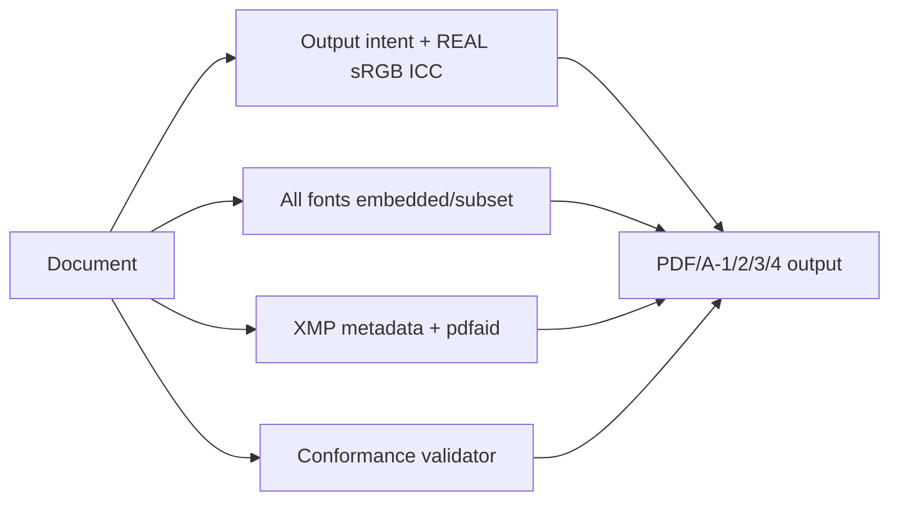
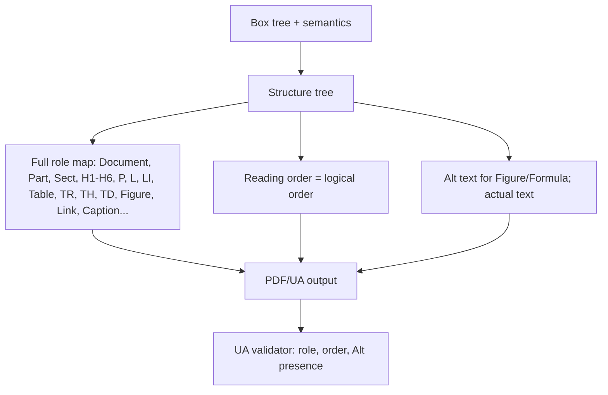
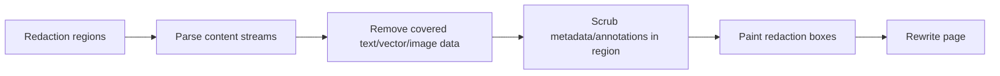
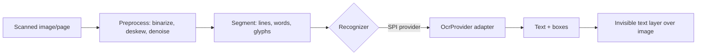

# 09 — Feature Modules

Each feature is a Layer-3 producer that builds on the kernel. All are original,
crypto-free, and driven through the `api` facade or `PdfToolkit`.

## 09.1 Barcodes (`barcode`)

- **1D**: Code128, Code39, EAN-8/13, UPC-A, ITF, Codabar.
- **2D**: QR (all versions + ECC levels), DataMatrix, PDF417, Aztec.
- Rendered as **vector** (crisp at any zoom), usable in markup (`<barcode>`-style
  element or CSS), programmatic API, or stamped onto existing PDFs.

## 09.2 Forms (`forms`)

- Create **AcroForm** fields: text, checkbox, radio, choice, button, signature
  placeholder (the placeholder only — signing itself is epdf-global).
- **Fill** existing form fields; regenerate appearance streams.
- **Flatten** to static content (irreversible bake-in).
- Field appearance honors fonts/colors from the same font subsystem.

## 09.3 PDF/A (`pdfa`)

- Conformance levels **A-1, A-2, A-3, A-4** (b/u/a as applicable).
- **Real, colorimetric sRGB ICC** output intent (the previous engine shipped a
  fake stub that fails validators — fixed here).
- Enforces: embedded fonts, no transparency violations (per level), device-
  independent color, XMP consistency, no disallowed features.
- Built-in **validator** aligned with the PDF/A test corpus (veraPDF-style checks)
  so output is verified before it leaves the engine.

## 09.4 PDF/UA & tagging (`tagged` + `pdfua`)

The previous engine emitted only `Table/TR/TD`. This is a full accessibility model:

- **Full role map** (not just tables): headings, lists, figures, links, TOC,
  captions, artifacts for decorative content.
- **Reading order** follows logical DOM/box order, independent of visual columns.
- **Alt text / ActualText** required-field validation (Figure, Formula, abbrev).
- **MCID management** in `tagged` shared with `pdfa` level-a.
- Built-in **UA checks**: every non-artifact content is tagged, roles valid,
  reading order present, Alt text where required.

## 09.5 Redaction (`redact`)

- True content removal (pdfSweep-style): the underlying text/graphics are
  **deleted**, not just covered — requires the kernel **reader** + content parser.
- Scrubs matching annotations, and optionally document metadata.

## 09.6 Optimization (`optimize`)

- **Object streams `/ObjStm`** + **cross-reference streams `/XRef`** → smaller
  files.
- **Image recompression** (re-encode/downsample oversized images; choose best
  filter).
- **Resource deduplication** by content hash (fonts, images, XObjects, shared
  dictionaries).
- **Font subsetting** on save; drop unused resources.
- Optional **linearization** ("fast web view").

## 09.7 XFA flattening (`xfa`)

- Parse XFA form packets and **flatten to static AcroForm/marked content** so the
  document renders identically without an XFA-capable viewer.
- Dynamic XFA is rendered to its current data state and baked in.

## 09.8 OCR (`ocr` — SPI + pipeline)

- epdf-org owns the **imaging pipeline** (preprocess/segment) and the **text-layer
  writer** (searchable/selectable text over the scan).
- The **recognizer** is an `OcrProvider` SPI — a trained model is out of scope for
  a from-scratch, dependency-free build and is supplied by an adapter. This keeps
  epdf-org honest about the boundary while still delivering the PDF-side work.

## 09.9 Debugging (`debug`, RUPS-like)

- Because the kernel has a real object model, `debug` can **walk and dump** the
  object graph: pages, resources, xref, streams (decoded), structure tree.
- Programmatic inspection (`debug.inspect(doc)`) plus a text/JSON export of the
  object tree for tooling — a RUPS-style view without any GUI dependency.
