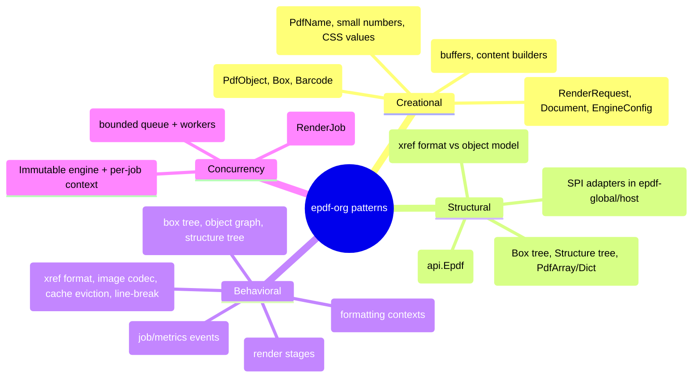
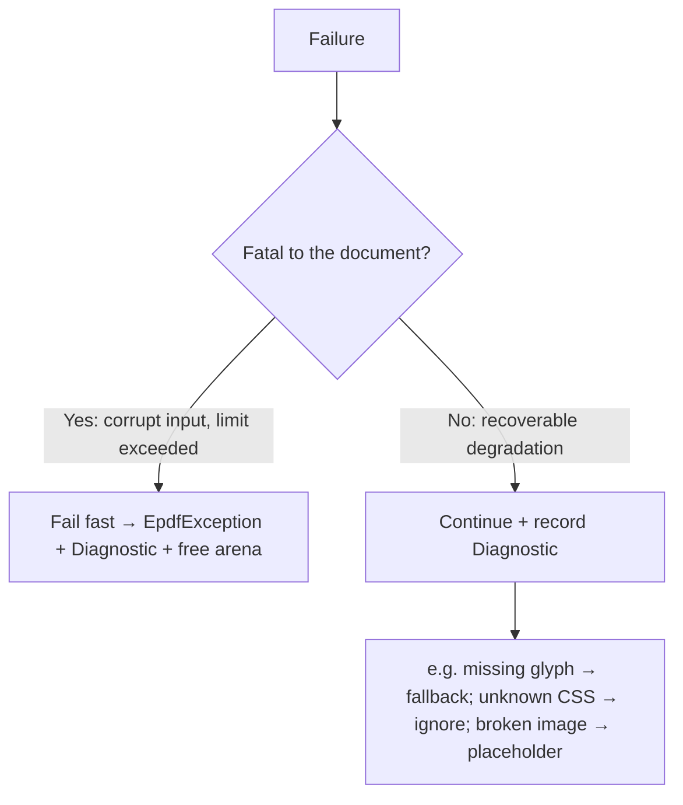
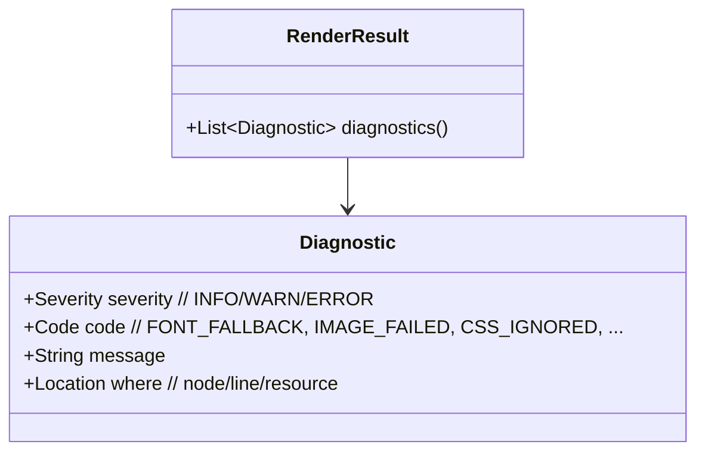

# 10 — Design Patterns & Failure Handling

## 10.1 Pattern map

### Where each earns its place

| Pattern | Applied to | Why |
|---|---|---|
| **Facade** | `api.Epdf` | One tiny surface; hides all internals |
| **Builder** | requests, documents, config, limits | Readable, immutable construction |
| **Strategy** | xref (classic/compressed), image codec, cache eviction, hyphenation | Swap behavior without touching callers |
| **Visitor** | box tree, object graph | Add passes (measure/paint/optimize/validate) without editing node classes |
| **Composite** | boxes, structure tree, `PdfArray/PdfDictionary` | Uniform tree handling |
| **Object Pool / Flyweight** | buffers, `PdfName`, CSS values | Cut allocations at scale |
| **Pipeline** | render stages | Isolated, testable, fuzzable steps |
| **SPI/Ports & Adapters** | crypto, OCR, fonts, loader | Keep crypto out; host controls IO |
| **Command/Event** | `RenderJob` | Treat each generation as an event; async, backpressure |

## 10.2 Failure-handling philosophy

Two failure classes, handled differently:

- **Fail fast** on: malformed PDF beyond recovery, exceeded `RenderLimits`,
  deadline, unsupported required feature. The job aborts cleanly and its arena is
  reclaimed immediately — one bad request never destabilizes the pool.
- **Degrade gracefully** on: missing font glyph (fallback), unknown CSS property
  (ignore), unfetchable image (placeholder + diagnostic), unsupported optional
  feature. The render still succeeds.

## 10.3 Diagnostics, not silent swallowing

The previous library swallowed exceptions (`catch (Exception ignored)`), so users
never learned *why* a font/image was dropped. Here every recoverable event
produces a structured `Diagnostic`:

- Nothing is silently ignored; it is **recorded and returned**.
- Diagnostics never include secrets or raw untrusted bytes.
- A strict mode can **promote WARN→ERROR** for pipelines that require perfection.

## 10.4 Error boundaries

- Each pipeline stage is wrapped so a failure is attributed to a stage + location.
- Resource operations are `AutoCloseable`; buffers return to pools in `finally`.
- The kernel writer flushes/streams so a mid-render failure doesn't leak a
  half-built document into the output stream (it writes to a guarded sink first
  when atomicity is requested).

## 10.5 Testability

- Pure, immutable stage I/O → deterministic unit tests without mocks.
- Golden-file tests: render → re-parse with the kernel reader → assert structure.
- Property/fuzz tests per parser.
- Architecture tests (no statics, layering) run in CI as ordinary JUnit-free tests
  using the in-house harness.
