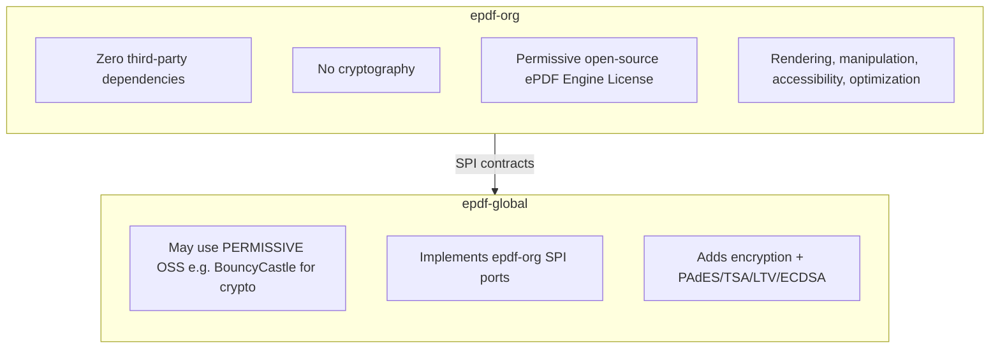
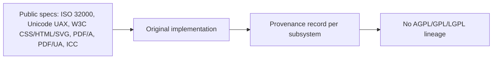

# 12 — Licensing & Build Boundaries

## 12.1 The two builds

| Aspect | epdf-org | epdf-global |
|---|---|---|
| Third-party libs | **None** (self-contained) | **Permissive only** (BouncyCastle, Adobe CMaps); never copyleft |
| Encryption/signing | **Excluded** (SPI only) | Provided |
| License | Permissive OSS (ePDF Engine License) | Permissive OSS (+ third-party notices, e.g. BouncyCastle) |
| Audience | Organisation-internal, strict compliance | Broader product needs |

## 12.2 Why crypto is excluded from epdf-org

1. **Self-containment**: epdf-org ships as a single zero-dependency jar, so it
   pulls in *no* external library — not even a permissive crypto provider.
   Hand-rolling cryptography is worse (a security anti-pattern). So epdf-org
   simply **does not do crypto** — that work moves to epdf-global, which may use a
   permissive, well-audited crypto library (see 12.7).
2. **Auditability**: "epdf-org performs no cryptography" is verifiable by
   inspection — there is no crypto code and no crypto dependency.
3. **Clean seam**: `spi.CryptoProvider` lets epdf-global (or the host) supply
   encryption/signing without epdf-org ever depending on it.

## 12.3 Clean-room / no-copyleft guarantee

Rules for every contribution:
- Implement from **specifications**, not from other libraries' source.
- **Never** copy, transcribe, or line-by-line port AGPL/GPL/LGPL code (copyright,
  not just patents, is the risk — a derivative of AGPL code would force AGPL on the
  whole product).
- Record the **spec reference** for non-obvious algorithms (bidi, shaping, xref,
  filters) in the source, so provenance is defensible.
- Test data (PDFs/fonts/images) must be self-created or public-domain.

## 12.4 Dependency policy (enforced)

- **epdf-org**: `pom.xml` has an **empty `<dependencies/>`**. A build check fails
  if any runtime/provided dependency is added — epdf-org stays self-contained.
- **epdf-global**: MAY depend on **permissive** OSS only (MIT/BSD/Apache/ISC and
  the BouncyCastle licence). It MUST NOT depend on or copy **copyleft** code
  (AGPL/GPL/LGPL) — and specifically **must never copy iText source or resource
  files** (incl. `sign` and `font-asian`), which are AGPL. iText using
  BouncyCastle does not make BouncyCastle copyleft; we use BouncyCastle directly
  under its own permissive licence.
- Tests use an **in-house assertion harness** (no JUnit), so even the test
  classpath is third-party-free.
- No code generation from third-party grammars/tools that would embed their output
  under a foreign license.

## 12.5 Distribution

- Single artifact `com.epdfengine.rb.org:epdf-org`.
- `LICENSE` + manifest entries declare the proprietary license and zero-dependency
  status.
- `epdf-global` depends on `epdf-org` and adds its crypto adapters — the boundary
  is a normal Maven dependency plus SPI wiring, never a code merge.

## 12.6 License-compatibility matrix

| Source | Licence | epdf-org | epdf-global |
|---|---|---|---|
| Our own code | ePDF Engine (permissive) | ✅ | ✅ |
| BouncyCastle | Bouncy Castle (MIT-style, permissive) | ❌ (zero-dep) | ✅ crypto/signing |
| Adobe CMap resources | BSD-3-Clause (from adobe-type-tools) | ❌ (no bundled resources) | ✅ only if predefined-CMap mode is added |
| MIT / BSD / Apache-2.0 / ISC libs | permissive | ❌ (zero-dep) | ✅ |
| **iText** (any module incl. `sign`, `font-asian`) | **AGPL-3.0** | ❌ **never** | ❌ **never** (no copy, no port, no bundled files) |
| Any AGPL/GPL/LGPL code or resource | copyleft | ❌ **never** | ❌ **never** |

Rule of thumb: **permissive = may depend on (epdf-global only); copyleft = never
touch.** "iText does X" tells us the *approach* is possible — never that we may
copy their code or bundle their files.

## 12.7 Signing & crypto plan (epdf-global)

Digital signing and encryption live in **epdf-global**, implementing
`com.epdfengine.rb.org.spi.CryptoProvider`. epdf-org itself stays crypto-free and
only declares the port.

- **Library**: **BouncyCastle** (permissive Bouncy Castle Licence) provides the
  CMS/PKCS#7, RSA/ECDSA and ASN.1 primitives. We use its **public API**; we do
  **not** copy iText's `sign` package (AGPL). BouncyCastle is **free open source**
  (MIT-style) — no paid licence is required to use it; only its optional
  FIPS-certified build and commercial support are paid. iText uses it under those
  same free terms; it did not buy a special licence, and its own AGPL licence does
  not attach to BouncyCastle.
- **Signatures**: PKCS#7 / CMS detached (`adbe.pkcs7.detached`) and **PAdES**
  (ETSI EN 319 142) profiles **B-B / B-T / B-LT / B-LTA**; **RSA (PKCS#1 & PSS)**
  and **ECDSA**; SHA-256/384/512.
- **Timestamping (TSA)**: RFC 3161 timestamp tokens for PAdES-B-T and above. The
  TSA client posts the message imprint to the TSA URL, optionally with **HTTP
  Basic auth (username/password)** — that is authentication to the timestamp
  server, part of **signing**, not encryption.
- **LTV**: OCSP/CRL revocation data embedded in the DSS for long-term validation
  (PAdES-B-LT/LTA).
- **Encryption** (separate feature): standard security handler AES-128/256 and
  public-key (certificate) encryption, again via BouncyCastle primitives.
- **Provenance**: implemented from the specs (ISO 32000, ETSI EN 319 142,
  RFC 3161, RFC 5652) + BouncyCastle API docs — never from iText source.
