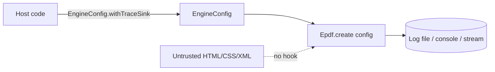

# 16 — Debugging & Pipeline Tracing

Debugging in epdf-org means **pipeline tracing**: for each render job the engine can
record which stage ran (`layout`, `serialize`, …), how long it took, and where it
failed. It is a diagnostic aid for the **host application**, not a document feature.

## 16.1 Off by default, host-only (security)

Tracing is **disabled** unless the host turns it on, and it can be enabled **only**
through the Java API. There is **no** CSS/HTML/XML/`<meta>` hook — an untrusted
document cannot switch on tracing, choose a log path, or cause any file write. This
is enforced by construction: the only enable seam is `EngineConfig`, consumed at
engine-construction time.



## 16.2 Enabling it

```java
import com.epdfengine.rb.org.debug.Debug;
import com.epdfengine.rb.org.runtime.*;
import java.nio.file.Path;

// 1) trace every render to a log file you choose
try (Epdf engine = Epdf.create(Debug.enabled(Path.of("logs/epdf-debug.log")))) {
    engine.render(RenderRequest.of(document).build());   // Mode B
    engine.render(RenderRequest.of(html).build());       // Mode A — same engine
}

// 2) trace to the console (System.err)
Epdf engine = Epdf.create(Debug.enabledToConsole());

// 3) turn it on for an existing config
EngineConfig cfg = Debug.enableOn(EngineConfig.defaults(), Path.of("logs/epdf.log"));

// 4) custom sink (any PrintStream / consumer)
EngineConfig cfg2 = EngineConfig.defaults().withTraceSink(TraceSink.toStream(printStream));
```

`Debug` helper summary:

| Call | Result |
|---|---|
| `Debug.enabled(Path)` | `EngineConfig` tracing to a log file |
| `Debug.enabledToConsole()` | `EngineConfig` tracing to `System.err` |
| `Debug.enableOn(config, Path)` | tracing added to an existing config |
| `Debug.fileSink(Path)` / `consoleSink()` / `streamSink(PrintStream)` | raw `TraceSink`s |

Check state with `EngineConfig.debugEnabled()` (true when a `TraceSink` is set).

## 16.3 What a trace shows

Each job emits a `PipelineTrace` recording the ordered stages with timing, and a
`fail(e)` marker if a stage throws — so you can see exactly where a slow or broken
render spent its time:

```
job-7  layout      3.9 ms
job-7  serialize   1.2 ms
job-7  TOTAL       5.1 ms
```

The trace is delivered to your `TraceSink` **after** the job completes, so it never
slows the hot path and a failing sink can never break a render.

## 16.4 Observability beyond a single trace

For fleet-level health (not per-job tracing), the engine exposes counters and JVM
state directly — no tracing required:

```java
engine.stats();                          // active / queued / completed / failed / rejected
engine.metrics();                        // latency histogram + counters
engine.runtimeStats().heapUsedRatio();   // heap/GC snapshot for load shedding
```

## 16.5 Try it in the playground

The playground’s **Engine features** panel has a **“Debug pipeline trace”** button
(`/api/tools/trace`) that renders a template with tracing enabled via the API and
shows the captured trace — demonstrating that tracing is host-enabled, never
document-enabled.

## 16.6 Rules of thumb

- Enable tracing in **dev / diagnostics**, and to a **rotating log** in production if
  needed — never rely on a document to request it.
- Prefer `stats()` / `metrics()` for continuous monitoring; use tracing to
  investigate a specific slow or failing input.
- Tracing writes only where you point it; the engine writes nothing inside the jar.
