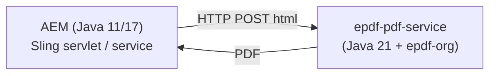

# 17 — Deployment, Scaling & Integration (Azure · AWS · Spring Boot · AEM)

Read this **before** you deploy. It covers how to run epdf-org in production, what
your app still owns, how to scale on Azure/AWS, how to use it inside **AEM**, the
**Java 21 requirement**, an honest list of **limitations**, and the **benchmark**.

---

## 17.1 Two ways to run it

| Model | What it is | Best when |
|---|---|---|
| **Embedded library** | Add the jar to your app; call the engine in-process. | Your app already runs on **Java 21** and you want the lowest latency (no network hop). |
| **PDF microservice** | A thin Spring Boot app (own JDK 21) that wraps the engine and exposes REST. | Callers are on **Java 11/17**, or non-JVM (.NET/Node/Python), or you want PDF generation isolated and independently scalable. |

> **The engine requires a Java 21 runtime.** If the host process isn't Java 21, use
> the microservice model — that's the whole point of it.

---

## 17.2 What the library handles vs. what your app owns

**The engine already does (inside one JVM):** CPU-bound work on a bounded worker
pool, virtual-thread I/O, **backpressure** (`BackpressureException`), streaming
output, byte-bounded caches, per-job deadlines, and **no shared mutable state**.
That's your **vertical** scaling — you don't write thread pools or queues.

**Your Spring Boot wrapper still owns (~30 lines):**

1. **One shared engine bean** — never create per request.

```java
@Configuration
class EngineConfigBean {
    @Bean(destroyMethod = "close")
    Epdf epdf(@Value("${epdf.threads:0}") int threads,
              @Value("${epdf.queue:10000}") int queue) {
        int t = threads > 0 ? threads : Runtime.getRuntime().availableProcessors();
        return Epdf.create(EngineConfig.defaults().withCpuThreads(t).withQueueCapacity(queue));
    }
}
```

2. **Stream the response** (keep heap flat):

```java
@PostMapping(value = "/pdf", produces = MediaType.APPLICATION_PDF_VALUE)
void pdf(@RequestBody String html, HttpServletResponse res) throws IOException {
    res.setContentType("application/pdf");
    epdf.renderTo(RenderRequest.of(html).build(), res.getOutputStream());
}
```

3. **Map backpressure → HTTP 429** so clients back off:

```java
@ExceptionHandler(BackpressureException.class)
ResponseEntity<String> busy(BackpressureException e) {
    return ResponseEntity.status(429).header("Retry-After", "1").body("engine saturated");
}
```

4. **Health / readiness + graceful shutdown** — expose `engine.stats()` /
   `engine.metrics()` for autoscaler signals; let in-flight jobs drain on SIGTERM.
5. **Config from env** (`epdf.threads`, `epdf.queue`, request size/time limits) so
   each replica self-tunes to its container.

---

## 17.3 Right-sizing (it's CPU-bound)

PDF layout/render is **CPU work**. Size for cores, not threads-per-request:

- Give each container **whole vCPUs** (e.g. **2–4 vCPU**).
- Set **engine threads = vCPUs** (the default already uses `availableProcessors()`).
- **Autoscale on CPU** with a target around **70%**.
- Memory: streaming keeps heap ≈ page working set; a **512 MB–1 GB** heap per pod is
  typically plenty. Set `-Xmx` below the container memory limit.
- Because instances are **stateless and share nothing**, there is **no sticky
  session and no shared cache** to coordinate — scaling out is linear.

---

## 17.4 Azure

| Service | Notes |
|---|---|
| **Azure Container Apps** (recommended, least ops) | KEDA autoscaling on CPU/HTTP concurrency, **scale-to-zero**, revisions. Set min/max replicas; give each revision 2–4 vCPU. |
| **AKS (Kubernetes)** | Deployment + **HPA** (`targetCPUUtilizationPercentage: 70`), `resources.requests/limits` in whole CPUs, `PodDisruptionBudget`, readiness probe. |
| **App Service (Linux, Java 21)** | Simple; scale-out rules on CPU. Fine for modest volume. |

Put **Azure Front Door / Application Gateway** in front for TLS + load balancing.
The 429 + `Retry-After` you emit lets the gateway/client retry gracefully during
bursts.

---

## 17.5 AWS

| Service | Notes |
|---|---|
| **ECS on Fargate** (recommended) | Task = 2–4 vCPU; **Service Auto Scaling** on CPU (~70%); ALB in front. No servers to manage. |
| **EKS (Kubernetes)** | Same HPA pattern as AKS. |
| **AWS Lambda** | Possible but **not ideal** for this workload: CPU-bound + cold starts (JVM + Java 21) hurt tail latency, and 15-minute/again-per-invoke model wastes the engine's in-JVM pooling. Prefer a long-running container (ECS/EKS) so the bounded pool and warm JIT pay off. Use Lambda only for low, spiky volume. |

---

## 17.6 Using it inside Adobe AEM

You can call epdf-org from AEM to render Sightly/HTL or component HTML to PDF — but
mind the **Java version**:

- **AEM commonly runs on Java 11 or 17** (AEM 6.5 / AEMaaCS). epdf-org needs
  **Java 21**, so you **cannot** drop the jar into an AEM instance that runs an
  older JVM as an OSGi bundle and expect it to load.
- **If your AEM JVM is Java 21**, you can package epdf-org as an **OSGi bundle**
  (it's a plain jar with an `Automatic-Module-Name`, no third-party deps to
  wrangle) and call it from a service — lowest latency, in-process.
- **If AEM is on Java 11/17 (the common case), use the microservice**: AEM calls the
  **epdf PDF service over HTTP** (author or publish tier → internal REST). This also
  keeps heavy PDF CPU off the AEM JVM, protecting author/publish responsiveness.

**Recommended AEM pattern:** run epdf-org as a **sidecar/microservice** and have an
AEM service (or a Sling servlet) POST the rendered HTML and receive the PDF. Feed it
AEM component HTML/CSS (Mode A) or build the document in Java (Mode B).



---

## 17.7 Pre-deploy checklist

- [ ] Host (or sidecar) runs **Java 21**.
- [ ] **One** engine instance, reused; `close()` on shutdown.
- [ ] Engine **threads = vCPUs**, queue sized for your burst tolerance.
- [ ] **429 + Retry-After** on `BackpressureException`.
- [ ] **Streaming** response for large PDFs.
- [ ] `ResourceLimits` set (max input bytes, pages, wall-clock) for untrusted input.
- [ ] **SSRF policy** via a host `ResourceLoader` if rendering fetches remote assets.
- [ ] Fonts supplied (none are bundled); embed for PDF/A.
- [ ] Debug tracing **off** in prod (enable only via API when diagnosing).
- [ ] Readiness/liveness probes; autoscale on **CPU ~70%**; min/max replicas set.

---

## 17.8 Benchmark report

**Setup:** 8-core host, JDK 21, warm JVM (1,500-render warm-up), then a timed burst
of **5,000 renders**; engine sized to `threads = 8`, queue large enough that nothing
is shed. **Document:** a ~1-page invoice with a 25-row styled table (`@page`,
borders, zebra striping) via **Mode A (HTML/CSS)**, ~3 KB output each.

| Metric | Value |
|---|---|
| Completed / failed / rejected | 5,000 / 0 / 0 |
| Wall time | ~9.6 s |
| **Throughput** | **~520 PDFs/sec** (≈ 1.9 M/hour on one 8-core box) |
| **Per-document service time** | **~15 ms** (wall × threads ÷ jobs) |

**How to read it:**
- Throughput is **CPU-bound and ~linear** — a 16-core box roughly doubles it, and
  more replicas multiply it.
- Throughput **scales inversely with document complexity** — heavy multi-page
  reports with images/large fonts are slower; simple docs faster.
- The separate "backpressure demo" (2 threads, queue 8 → 190/200 rejected) is **not
  a throughput benchmark** — it deliberately starves the engine to show load
  shedding.

**Honesty caveat:** this is a **warm single-JVM microbenchmark on one document
type**, representative — **not** a certified SLA. Measure with *your* templates,
fonts and images before committing to numbers. Reproduce with the harness in
`proto/test/pdfa-verify/GenBench.java`.

---

## 17.9 Rule of thumb

> The **library** carries in-process scalability (pool, backpressure, streaming);
> **you** add a thin, stateless Spring Boot wrapper (429 + streaming + health +
> config-from-env); and **the platform** (Container Apps / AKS / ECS) adds replicas
> via CPU autoscaling. No concurrency code, no re-architecting.
