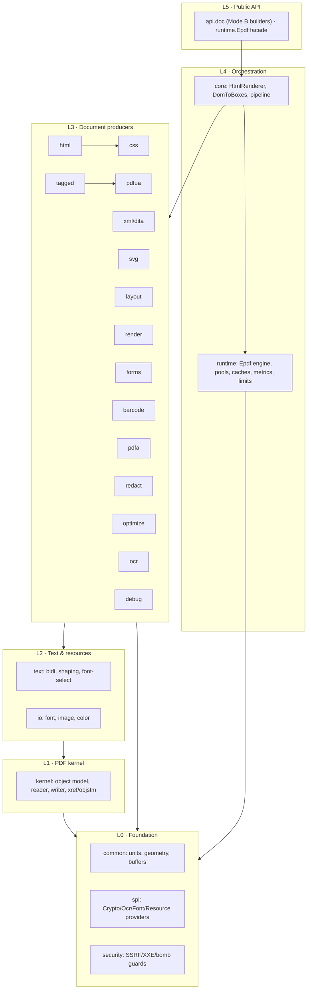
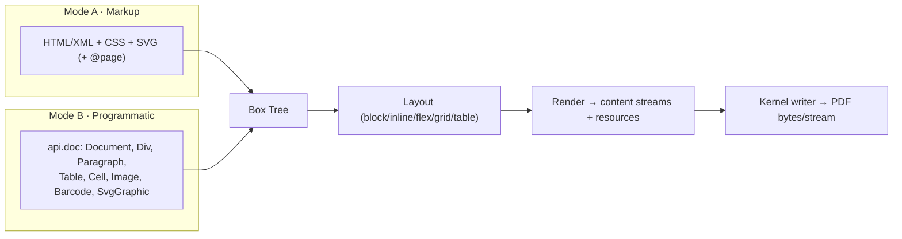
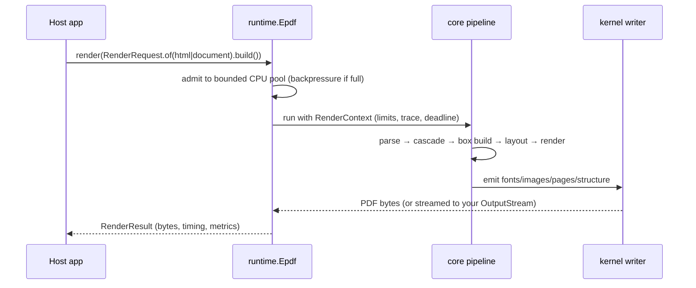
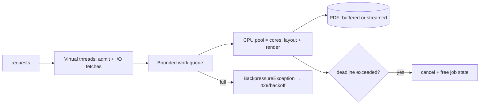

# ePDF Engine (`epdf-org`) — Complete Guide & Architecture

> One document for engineers **and** architects: how to generate PDFs in both
> modes, the syntax for every feature, the concurrency model for high-volume
> deployments, the security posture, and the architecture — including *why it is a
> safe, dependency-free alternative to third-party libraries*.

- **Package root:** `com.epdfengine.rb.org`
- **Runtime:** Java 21 (records, sealed types, virtual threads, ZGC-friendly)
- **Packaging:** a single jar, **zero third-party dependencies**
- **License:** the permissive *ePDF Engine License* (use in commercial/closed
  products; **not** AGPL/GPL). Original clean-room work.

---

## 0. Executive summary — the two modes, and who owns what

There is **one engine** and **one internal box tree**. You drive it two ways, and
they converge on the same layout/render/writer path:

- **Mode A — Markup.** Layout and styling are defined in **HTML/CSS** (and XML/DITA,
  SVG). Focused on *presentation*: page geometry, visual design, typography.
- **Mode B — Programmatic.** The document is built with **Java function calls**
  (`Document`, `Div`, `Paragraph`, `Table`, `Barcode`, …). Focused on *function*:
  things a document must **not** control, plus code-driven generation.

Page size, margins and layout can be expressed in **either** mode. Everything that
decides *what the engine is allowed to do* is **Mode B / host-only** by design.

### Who owns what

| Concern | Mode A (document) | Mode B / host (code) | Notes |
|---|:---:|:---:|---|
| Page size & margins | ✅ `@page` | ✅ `Document.of(...).margins(...)` | **common — either mode** |
| Layout, tables, lists, text, images, barcodes, SVG | ✅ | ✅ | **common — either mode** |
| Colours, borders, radius, fonts *by name* | ✅ | ✅ | **common — either mode** |
| Rich visual styling (gradients, shadow, blur, animation, complex selectors) | ✅ | ⚠️ basic only | Mode A strength |
| **Enable debug / tracing + log destination** | ❌ | ✅ | host-only (security) |
| **Resource limits** (max pages/bytes/wall-clock) | ❌ | ✅ | DoS protection |
| **Network / SSRF policy** (`ResourceLoader`) | ❌ | ✅ | doc may *request*; host decides |
| **Font files from disk** (`FontRegistry`) | ❌ (names only) | ✅ | host chooses files |
| **Threads / queue / backpressure** (`EngineConfig`) | ❌ | ✅ | operational policy |
| **Conformance, metadata, crypto/sign SPI** | ❌ | ✅ | archival/security posture |

> **Rule of thumb:** *Mode A = what the document looks like; Mode B = what the
> engine is allowed to do.* The untrusted document can never switch on tracing,
> read arbitrary files, reach internal hosts, or lift resource limits.

### Why an architect should feel safe adopting it

- **No third-party code** → **no transitive CVE surface** to monitor, no supply-chain
  risk, no license entanglement. "Does it do X (e.g. crypto)?" is answerable by grep.
- **Clean-room, permissive licence** → usable in closed/commercial products without
  the AGPL obligations of some incumbents.
- **Security is structural** (see §11): SSRF/XXE/bomb guards, resource limits, and a
  hard crypto boundary are part of the design, not add-ons.
- **Scales as a stateless service** (see §10): immutable engine, per-job context, no
  static mutable state, bounded pools with backpressure.

---

## 1. What makes it unique

| Area | What `epdf-org` does | Why it matters |
|---|---|---|
| **Dependencies** | none (single jar) | zero CVE/licence supply chain |
| **Licence** | permissive (not AGPL) | commercial/closed use without royalties |
| **Two front doors, one box tree** | Mode A markup **and** Mode B Java build the same tree | one code path, identical output, no drift |
| **Advanced HTML/CSS** | flex, grid, multi-column, `@page`, gradients, per-side/rounded borders, box-shadow, backdrop-blur, keyframe animation, attribute/multi-class selectors | modern design fidelity in static PDF |
| **Fonts** | TrueType embedding **+ subsetting**, per-codepoint fallback, correct 1000-em metrics | small files, correct glyphs, multilingual |
| **Modern forms** | HTML `<input>/<select>/<textarea>/<button>` → real AcroForm, incl. HTML5 (`placeholder`, `required`, `pattern`, `min/max/step`, datalist combo), fill & flatten | interactive PDFs from markup |
| **XML / DITA** | DITA topics & maps → styled PDF, `keyref`/keys, generated TOC | technical publishing, clean-room DITA-OT-style |
| **Barcodes** | QR, Code 128/39, EAN-13, Data Matrix — clean-room | no external barcode lib |
| **Vector SVG** | drawn as native PDF vector operators | crisp at any zoom |
| **Optimize / linearize** | object & xref streams, image dedup, fast-web-view linearization | smaller files, faster web delivery |
| **Accessibility / archival** | PDF/A-2b + PDF/UA-1 tagging, structure tree, `/Alt`, reading order | compliance |
| **Scale** | bounded CPU pool + virtual-thread I/O, backpressure, streaming, byte-bounded caches, metrics | steady memory at org volume |

> Positioning vs incumbents (e.g. iText): iText is AGPL / commercial-licensed and
> pulls its own dependency set. `epdf-org` is a **clean-room, permissively-licensed,
> zero-dependency** engine with a modern HTML/CSS front end and a security-first,
> scalable runtime. (No iText code is used or derived.)

---

## 2. Architecture (for architects)

### 2.1 Strict layering — dependencies point downward only



### 2.2 Two front doors → one box tree → one output



### 2.3 Request data flow



### 2.4 Ports & adapters (SPI) — the trust boundary

Anything the org build must **not** implement itself is a port in `spi`, supplied by
the host (or the sibling `epdf-global`):

| SPI port | Default in `epdf-org` | Host adapter |
|---|---|---|
| `CryptoProvider` | none — throws "not available in org build" | AES / PKCS7 / PAdES |
| `OcrProvider` | no-op / pass-through | trained OCR model |
| `FontProvider` | user-supplied files only | corporate font service |
| `ResourceLoader` | SSRF-safe default | host-controlled fetcher |

This makes the **crypto boundary a compile-time guarantee**: no code path in
`epdf-org` performs cryptography.

### 2.5 Why it scales (state model)

- The **engine is immutable and shared** across threads/requests.
- All per-request mutable state lives in a **`RenderContext`** created per job.
- **No `static` mutable fields** in production packages (the #1 defect class in
  legacy engines). Caches are engine-scoped instances.

---

## 3. Generating a PDF — quickstart

**One engine, reused, thread-safe.** Create it once; submit many jobs.

```java
import com.epdfengine.rb.org.runtime.*;

try (Epdf engine = Epdf.create()) {
    // Mode A — markup drives layout
    byte[] a = engine.render(RenderRequest.of(htmlString).build()).bytes();

    // Mode B — Java drives layout
    Document doc = Document.of(PageSpec.A4).margins(40)
            .add(Paragraph.heading(1, "Invoice #42"))
            .add(Paragraph.of("Thank you for your business."));
    byte[] b = engine.render(RenderRequest.of(doc).build()).bytes();
}
```

Other calls (identical for both modes):

```java
engine.submit(request);                 // CompletableFuture<RenderResult> (async)
engine.renderTo(request, outputStream); // stream straight out, no byte[] retained
engine.submitTo(request, outputStream); // async streamed
engine.stats();                         // active / queued / completed / failed / rejected
engine.runtimeStats().heapUsedRatio();  // load-shedding signal
engine.metrics();                       // counters + latency histogram
```

`RenderRequest.Builder` (both modes): `.fonts(FontRegistry)`,
`.conformance(Conformance)`, `.metadata(DocumentMetadata)`, `.limits(ResourceLimits)`.
Mode A also: `.params(LayoutParams)`, `.resources(ResourceLoader)`.

A lightweight alternative for Mode A without the engine facade:
`new HtmlRenderer().render(html, LayoutParams.a4(36), fonts, resources)`.

---

## 4. Mode A syntax (markup)

Page geometry and everything visual live in the markup; the backend passes only data.

```html
<style>
  @page { size: A4; margin: 40pt; }        /* or: size: 210mm 297mm; A4 landscape */
  body { font-family: "Open Sans"; color: #334155; }
  .cards { display: grid; grid-template-columns: 1fr 1fr 1fr; gap: 10px; }
  .card  { background: #fff; border: 1pt solid #e2e8f0; border-radius: 8px; padding: 12px; }
  .hero  { background: linear-gradient(90deg, #0f172a, #1e293b); color: #fff; }
  thead th { background: #f1f5f9; }
  tbody tr:nth-child(even) { background: #f8fafc; }   /* zebra */
</style>
<div class="hero"> … </div>
<div class="cards"> <div class="card">…</div> … </div>
<table> <thead>…</thead> <tbody>…</tbody> </table>
<a href="#notes">jump to notes</a>            <!-- internal link -->
 <svg>…</svg>            <!-- images + inline SVG -->
```

Supported CSS highlights: block/inline flow, **flexbox**, **CSS grid** (areas, spans,
`repeat()`), **multi-column**, `@page` size/margins/fit, gradients (linear/radial/conic),
per-side & rounded borders, box-shadow, `backdrop-filter: blur()`, keyframe
animations, attribute & multi-class selectors, `nth-child`, colour in hex/rgb/rgba/named.

---

## 5. Mode B syntax (Java, `com.epdfengine.rb.org.api.doc`)

```java
Document doc = Document.of(PageSpec.A4).margins(40).background(0xF8FAFC)
    .add(Div.row().gap(12).padding(14).background(0x0F172A).borderRadius(10)
            .add(SvgGraphic.of("<svg>…</svg>").width(120).height(40))
            .add(Paragraph.of("ACME — Invoice").color(0xFFFFFF).fontSize(20).bold().grow(1)))
    .add(Paragraph.heading(2, "Programmatic demo"))
    .add(Div.grid("1fr 1fr 1fr").gap(10)
            .add(card("Revenue", "$128k")).add(card("Orders", "1,204")).add(card("Refunds", "12")))
    .add(Table.columns("55%", "15%", "30%")
            .header("Item", "Qty", "Amount")
            .row("Rack 42U", "2", "$1,998.00")
            .add(Row.create().add(Cell.of("Total").bold().colSpan(2))
                             .add(Cell.of("$3,194.00").bold().align(TextAlign.RIGHT))))
    .add(ListBlock.bulleted().item("All prices exclude tax.").item("Net 30 terms."))
    .add(Div.row().gap(20)
            .add(Barcode.qr("https://ex.org/pay/42").width(90).height(90))
            .add(Barcode.code128("INV-42").width(200).height(60)));
```

Builders: `Document`, `PageSpec`, `Div` (`create/row/column/grid`), `Paragraph`
(`of/empty/heading`), `Text` (inline `of/bold/colored/link`), `ListBlock`
(`bulleted/ordered`), `Table`/`Row`/`Cell`, `Image` (`of/fromFile`), `Barcode`
(`qr/code128/code39/ean13/dataMatrix`), `SvgGraphic`. Shared style setters on every
builder: `padding/margin/background/border/borderRadius/width/widthPercent/height/
color/fontSize/font/bold/italic/align/role/id`.

---

## 6. Common capabilities — both syntaxes side by side

| Capability | Mode A | Mode B |
|---|---|---|
| Page size / margins | `@page { size:A4; margin:40pt }` | `Document.of(PageSpec.A4).margins(40)` |
| Landscape / custom | `size: A4 landscape` / `210mm 297mm` | `PageSpec.A4.landscape()` / `PageSpec.mm(210,297)` |
| Heading | `<h1>Title</h1>` | `Paragraph.heading(1, "Title")` |
| Paragraph | `<p>…</p>` | `Paragraph.of("…")` |
| Bold / colour / size | `font-weight;color;font-size` | `.bold().color(0x…).fontSize(20)` |
| Mixed inline | `<strong>…</strong> <span style=color>…</span>` | `Text.bold("…") / Text.colored("…",rgb)` |
| Link | `<a href="…">` / `href="#id"` | `Text.of("…").link("…")` / `.id("…")` |
| Container / flex / grid | `display:flex/grid` | `Div.row()/column()/grid("…")` |
| Table (spans, widths) | `<table><td colspan=…>` | `Table.columns(…)…Cell.colSpan(n)` |
| List | `<ul>/<ol><li>` | `ListBlock.bulleted()/ordered().item(…)` |
| Image / barcode / SVG | `` / `barcode:` / `<svg>` | `Image.of` / `Barcode.qr` / `SvgGraphic.of` |
| Fonts (embed) | `font-family` + `RenderRequest.fonts(...)` | `Document.fonts(...)` + `.font("…")` |
| PDF/A + PDF/UA | `renderConformant(...)` | `Document.conformance(...)` |

---

## 7. Advanced HTML/CSS (implemented in-house)

- **Flexbox**: row/column, `flex-grow/shrink/basis`, `justify-content`,
  `align-items` (incl. baseline), wrap.
- **CSS grid**: `grid-template-columns/rows/areas`, `repeat()`, `span`,
  `grid-auto-flow: dense`, subgrid, stretch alignment, multi-row spans.
- **Multi-column** (`column-count`/`columns`): balanced magazine layouts.
- **Paged media**: `@page` size/margins, running headers/footers, `counter(page)`
  / `counter(pages)`, page-break controls, keep-together.
- **Backgrounds**: linear/radial/conic gradients; `rgba`/`#rrggbbaa` alpha;
  `backdrop-filter: blur()` frosted glass.
- **Borders**: per-side widths & colours, per-corner radius, dashed/solid, accent
  stripes; radius survives overlays via clipping.
- **Motion**: `@keyframes` transforms baked into optional-content frames.
- **Typography**: embedded TrueType **subsetting**, per-codepoint font fallback,
  letter-spacing, WinAnsi punctuation mapping (bullets, dashes, smart quotes).
- **Selectors**: type/class/id, attribute (`input[type=email]`), multi-class
  (`.side-card.dark`), `nth-child`, specificity-correct cascade.

---

## 8. Forms — HTML/CSS → real AcroForm

`<input>`, `<textarea>`, `<select>`, `<button>` become **real, fillable** AcroForm
fields styled from CSS:

- Field types: text, password, checkbox, radio group, choice/dropdown, multiline,
  push button.
- **HTML5**: `placeholder`, `maxlength`, `readonly`, `required`, `multiple`,
  `pattern`, `min/max/step`, comb fields, `<input list=…>` → editable combo.
- Styling: rounded/outlined inputs, accent colours, card layouts.
- **Fill & flatten** (server-side): `FormFiller.fill(pdf, values)` and
  `FormFiller.flatten(pdf)` to bake values into static content.

Mode B builds AcroForms programmatically via the kernel `AcroForm` helper.

---

## 9. XML / DITA publishing

- **DITA topics** (concept/task/reference) → styled HTML → PDF
  (`DitaTransformer.topicToHtml`).
- **DITA maps** (`.ditamap`) → one publication with resolved `topicref`
  hierarchy and a **generated numbered TOC** (`DitaMap.mapToHtml`).
- **`keyref` / keys**: variable text and key-based links resolved clean-room
  (DITA-OT-style), with the XML→HTML mapping kept separate from layout.
- **XXE-proof** parser (no external entities, no DTD fetch) — see §11.

---

## 10. Concurrency & scalability (for organisations)

The `Epdf` engine is built to sustain high request volume with **stable memory**.



- **Bounded CPU pool ≈ cores** runs the CPU-bound layout/render so work never
  oversubscribes the machine.
- **Virtual-thread I/O pool** (Java 21) handles blocking resource fetches; a
  single instance can prefetch many assets concurrently without pinning OS threads.
- **Backpressure**: a full bounded queue raises `BackpressureException` (shed load
  cleanly) instead of unbounded queuing / OOM. Tune with
  `EngineConfig.withCpuThreads(n).withQueueCapacity(q)`.
- **Deadlines / cancellation**: per-job wall-clock limit cancels runaway documents
  and frees their state — one bad input can't exhaust the pool.
- **Streaming writer**: emits to your `OutputStream` incrementally; peak heap is
  ~O(page working set), not O(document).
- **Byte-bounded LRU caches** (fonts/images by content hash) so a few large assets
  can't blow the heap; identical assets dedupe across requests.
- **Pooled `Deflater`** for compression; **no static mutable state**; per-job
  `RenderContext`.
- **Observability**: `engine.stats()` (active/queued/completed/failed/rejected),
  `engine.metrics()` (latency histogram), `engine.runtimeStats()` (heap/GC).

```java
EngineConfig cfg = EngineConfig.defaults()
        .withCpuThreads(Runtime.getRuntime().availableProcessors())
        .withQueueCapacity(10_000)
        .withDefaultLimits(ResourceLimits.defaults());
try (Epdf engine = Epdf.create(cfg)) {
    engine.submit(request).thenAccept(r -> store(r.bytes()));
}
```

> **Integration:** the engine is framework-agnostic — Spring Boot, a servlet, a CLI
> batch, or serverless. For legacy Java 11 consumers, run it as a small REST
> microservice; the engine itself needs Java 21.

---

## 11. Security — a design property

```mermaid
flowchart TB
    U[Untrusted input] --> HTML[HTML/CSS/SVG/XML]
    U --> PDFIN[Imported PDF]
    U --> ASSET[Fonts / images]
    U --> URLS[Remote url() refs]
    HTML --> G1[XXE / entity expansion — blocked]
    HTML --> G2[Deep nesting / node count — capped]
    PDFIN --> G3[Decompression bombs — ratio+size caps]
    PDFIN --> G4[Malformed xref loops — bounded recovery]
    ASSET --> G5[Font/image parser OOB — bounds-checked]
    URLS --> G6[SSRF / internal hosts — policy-gated]
```

- **Zero dependencies → no transitive CVE surface** to track. Major operational win.
- **SSRF-safe loading**: every fetch (incl. the top URL) is policy-gated; no blind
  redirects (each hop re-validated); private/link-local/metadata IP ranges blocked;
  **resolved IP pinned** (defeats DNS-rebinding); host allowlist; per-job byte budget.
- **XXE-proof**: no external entity resolution, no DTD fetching; entity-expansion
  and nesting/node caps (billion-laughs safe).
- **Decompression & parser bombs**: every filter enforces an absolute output cap +
  max expansion ratio; image decoders cap pixels/dimensions before allocating; font
  parsers validate table bounds; PDF xref recovery is bounded.
- **Resource limits** (`ResourceLimits`): max input bytes, DOM nodes, nesting, pages,
  image pixels, decompressed bytes, per-job fetch bytes, wall-clock — trip → fast,
  precise failure.
- **Crypto boundary**: `epdf-org` contains **no cryptographic code**; `CryptoProvider`
  is the only seam and defaults to *none*.
- **Debug is host-only** (see §12): no CSS/HTML/XML hook can enable tracing or write
  files — verified by a whole-engine search finding zero debug references outside the
  `debug`/`runtime` packages.
- **Secure-by-default**: no `Runtime.exec`, no input-driven reflection, no Java
  serialization; diagnostics never echo secrets.

---

## 12. Enabling debug (host-only) — syntax

Debugging is **off by default** and can be switched on **only** through the Java API,
by the host — never by a document. The per-PDF pipeline trace (which stage ran, how
long, where it failed) is written to a destination **you choose**.

```java
import com.epdfengine.rb.org.debug.Debug;
import com.epdfengine.rb.org.runtime.*;
import java.nio.file.Path;

// 1) trace every render to a log file you choose
try (Epdf engine = Epdf.create(Debug.enabled(Path.of("logs/epdf-debug.log")))) {
    engine.render(RenderRequest.of(document).build());
}

// 2) trace to the console (System.err)
Epdf engine = Epdf.create(Debug.enabledToConsole());

// 3) turn it on for an existing config
EngineConfig cfg = Debug.enableOn(EngineConfig.defaults(), Path.of("logs/epdf.log"));

// 4) custom sink
EngineConfig cfg2 = EngineConfig.defaults().withTraceSink(TraceSink.toStream(printStream));
```

`EngineConfig.debugEnabled()` reports whether tracing is on. Because the enable path
is `EngineConfig` only, **untrusted HTML/CSS cannot turn it on** — the property you
asked for, enforced by construction.

---

## 13. PDF toolkit (existing PDFs)

```java
byte[] merged   = PdfMerger.merge(a, b);                        // combine
byte[] page1    = PdfMerger.extractPages(pdf, 0);               // subset
byte[] compact  = PdfOptimizer.optimize(pdf);                   // obj/xref streams + dedup
PdfOptimizer.Result rep = PdfOptimizer.optimizeWithReport(pdf); // + size report
byte[] fastWeb  = Linearizer.linearize(pdf);                    // fast web view
byte[] filled   = FormFiller.fill(pdf, Map.of("name","Ada"));   // fill AcroForm
byte[] flat     = FormFiller.flatten(filled);                   // bake fields
byte[] redacted = Redactor.apply(pdf, List.of(new Redactor.Box(0, 72, 700, 180, 16)));
```

---

## 14. Capability matrix (quick reference)

| Feature | Mode A | Mode B | Toolkit |
|---|:---:|:---:|:---:|
| Page size / margins from source | ✅ | ✅ | — |
| Flex / grid / multi-column | ✅ | ✅ (flex/grid) | — |
| Tables (spans, zebra, repeating header) | ✅ | ✅ | — |
| Lists (bulleted / numbered) | ✅ | ✅ | — |
| Images / SVG / barcodes | ✅ | ✅ | — |
| Gradients / shadow / blur / animation | ✅ | ⚠️ basic | — |
| Embedded fonts + subsetting + fallback | ✅ | ✅ | — |
| Forms → AcroForm, fill & flatten | ✅ | ✅ | ✅ |
| PDF/A-2b + PDF/UA-1 tagging | ✅ | ⚠️ headings | — |
| XML / DITA publishing | ✅ | — | — |
| Merge / split | — | — | ✅ |
| Optimize / linearize | — | — | ✅ |
| Redact (visual) | — | — | ✅ |
| Async / streaming / backpressure / metrics | ✅ | ✅ | — |
| Debug tracing (host-enabled) | ✅ | ✅ | — |

⚠️ = supported at a basic level; the other mode is richer.

---

*Clean-room, zero-dependency, permissively licensed. No third-party or copyleft code;
cryptography is intentionally out of scope (SPI hook only). Author: Rupesh Borse.*
